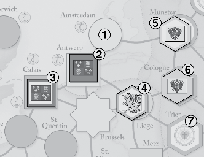

# Here I Stand 规则（中文分节版）

来源：
- `his_ref/HIS-Rules-2010.pdf`
- `his_ref/rulebook_extraction/RULEBOOK_SECTION_NORMALIZED.md`

说明：
- 本文按原书章节编号翻译为中文，优先保持与英文原文的术语和句义对应关系。
- 当前版本已将第 2 章改为逐句直译风格；其余章节仍有整理式表述，后续将继续按同一标准转换。
- 若遇到与实体规则书冲突，以英文原书为准。

## 目录

- `1` 引言
- `2` 地图
- `2.1` 空间类型
- `2.2` 政治控制
- `2.3` 宗教影响
- `2.4` 控制标记
- `2.5` 其他地图元素
- `3` 势力与君主
- `3.1` 玩家
- `3.2` 主要势力
- `3.3` 君主
- `4` 势力板
- `5` 军事单位
- `5.1` 将领
- `5.2` 陆军
- `5.3` 海军
- `6` 卡牌
- `6.1` 卡牌类型
- `6.2` 牌库
- `7` 回合流程
- `8` 回合开始
- `8.1` 第 1 回合
- `8.2` 抽牌阶段
- `9` 外交
- `9.1` 谈判
- `9.2` 同盟
- `9.3` 求和
- `9.4` 赎回将领
- `9.5` 解除绝罚
- `9.6` 宣战
- `10` 春季调动
- `11` 行动阶段
- `11.1` 行动清单
- `12` 控制与动乱
- `12.1` 交通线（LOC）
- `12.2` 无防御空间控制
- `12.3` 要塞空间控制
- `12.4` 动乱
- `13` 陆上移动
- `13.1` 陆上移动流程
- `13.2` 拦截
- `13.3` 规避战斗
- `13.4` 退入工事
- `14` 野战
- `14.1` 撤退
- `15` 围城
- `15.1` 强攻
- `15.2` 解围军
- `15.3` 破围
- `16` 海军事务
- `16.1` 海上移动
- `16.2` 海战
- `16.3` 海运
- `16.4` 海盗
- `17` 建造
- `17.1` 陆军建造
- `17.2` 海军建造
- `18` 宗教改革
- `18.1` 宗教行动
- `18.2` 宗教修正
- `18.3` 改宗尝试
- `18.4` 反改宗尝试
- `18.5` 神学辩论
- `19` 冬季
- `19.1` 归还借舰标记
- `19.2` 叛将移除
- `19.3` 回归驻地
- `19.4` 清除主要势力同盟标记
- `19.5` 冬季补员
- `19.6` 清除海盗标记
- `19.7` 辩士复原
- `19.8` 到期强制事件
- `20` 新大陆
- `20.1` 殖民
- `20.2` 探索航行
- `20.3` 征服航行
- `20.4` 新大陆财富
- `21` 主要势力特规
- `21.1` 奥斯曼
- `21.2` 哈布斯堡
- `21.3` 英格兰
- `21.4` 法兰西
- `21.5` 教廷
- `21.6` 新教
- `21.7` 海外战争卡
- `22` 次要势力
- `22.1` 未激活次要势力
- `22.2` 激活
- `22.3` 激活状态规则
- `22.4` 失活
- `22.5` 匈牙利-波希米亚战败
- `22.6` 独立关键城
- `23` 胜利
- `23.1` 自动胜利
- `23.2` 胜利点
- `23.3` 胜利判定阶段

## 1 引言

`Here I Stand` 描述 1517-1555 年欧洲宗教改革时期的军事、政治与宗教冲突。玩家控制主要势力，通过战争、外交、宗教改革与新大陆扩张竞争胜利。（图像：`his_ref/rulebook_extraction/images/page_003_Im0_obj_5.png`）
## 2 地图

地图由空间（城市/要塞）和连接线组成。空间之间通过陆路或海路连接。政治控制与宗教影响是两条并行状态轨道，都会随游戏推进改变。

### 2.1 空间类型

游戏中的所有空间，要么是有防御空间（fortified space），要么是无防御空间（unfortified space）。
有防御空间：有防御空间代表一座有城墙的城市（或城镇）。势力必须成功围攻该有防御空间，才能获得该城市的政治控制。最多可有 4 个友方陆军单位留在有防御空间内，用于防御敌方围城。有防御空间也作为冬季驻地。

有防御空间分为 3 种：

1. 关键城（Key）：
关键城是以方形表示的有防御空间。关键城是最有影响力、最富有的空间；控制关键城可为势力带来胜利点与卡牌。6 个关键城带有“双方框”边框（伦敦、巴黎、巴利亚多利德、维也纳、罗马、伊斯坦布尔）；这些关键城是首都。哈布斯堡有 2 个首都（巴利亚多利德、维也纳），新教没有首都，其余 4 个主要势力各有 1 个首都。

2. 选帝侯（Electorate）：
选帝侯是以六边形表示的有防御空间。地图上共有 6 个选帝侯，全部位于德意志地区。每个选帝侯代表一位有权选举神圣罗马皇帝的选侯之本城。这些空间是游戏中德国政治与宗教斗争的核心。选帝侯不是关键城，但对关注德国事务的势力（哈布斯堡、教廷、新教）非常重要。

3. 要塞（Fortress）：
要塞是以八角圆形表示的有防御空间。要塞是有城墙、但经济价值较低的城镇。要塞本身不会直接提供额外胜利点或卡牌。但要塞防御坚固，进攻方必须围攻该空间才能取得政治控制。若干事件卡允许玩家在游戏过程中，把一个无防御空间建设为要塞。

无防御空间（Unfortified Space）：
无防御空间以圆形表示。这类空间代表不需要围城即可取得控制的城市（或城镇）。若两个处于战争状态的势力同时占据同一个无防御空间，必须进行野战。

本土空间（Home Space）：
灰色填充的空间是独立空间，不隶属于游戏中的任何势力。其余空间则是某一势力的本土空间，具体见下表。该势力称为该空间的“本土势力（home power）”。

主要势力本土空间颜色：
- 奥斯曼：深绿色
- 哈布斯堡：黄色
- 英格兰：红色
- 法兰西：深蓝色
- 教廷：紫色
- 新教：棕色边框 + 白色中心

次要势力本土空间颜色：
- 热那亚：粉色
- 匈牙利/波希米亚：浅绿色
- 苏格兰：浅蓝色
- 威尼斯：橙色

### 2.2 政治控制

每个空间的政治控制在整个游戏中都会被追踪。默认情况下，每个空间都处于其本土势力的政治控制之下。随着政治控制发生变化，会在该空间上放置控制标记，以表示该空间的政治控制已变为非本土势力。这些控制标记按势力进行颜色区分，并且也包含该势力在 16 世纪使用的旗帜。（图像：`his_ref/rulebook_extraction/images/page_004_Im2_obj_11.png`）
已控制空间（Controlled space）：
由主要势力或次要势力控制的空间称为已控制空间。某势力的已控制空间包括：
- 尚未落入其他势力之手的本土空间；
- 被该势力夺取的独立（灰色）空间；
- 被该势力夺取的其他势力本土空间；
- 其同盟次要势力的本土空间。

第二版规则注记：页边的竖线表示相对于第一版规则新增或修改的内容。

控制术语（Control Terminology）：

`friendly`（友方）：
术语“友方”指任何由当前行动势力，或该势力的同盟，所控制的游戏要素（空间、单位、叠堆、编队、辩士）。

`enemy`（敌方）：
术语“敌方”指任何由当前与行动势力处于战争状态的势力所控制的游戏要素。另外，教廷辩士与新教辩士始终互相视为敌方。

`independent`（独立）：
术语“独立”指任何不由主要势力或次要势力控制的游戏要素。就任何规则目的而言，独立游戏要素都不被视为友方或敌方要素。

示例（EXAMPLES）：
独立单位不能拦截移动中的部队，因为只有敌方编队可以尝试拦截。相邻的独立单位不会阻止未占领、无防御空间被控制；而若存在相邻敌方单位，则该控制会被限制。

### 2.3 宗教影响

随着宗教改革席卷欧洲，许多空间中的主导基督教教派（天主教或新教）会在游戏过程中发生变化。只有奥斯曼本土空间（被视为穆斯林或东正教）不受此类宗教影响变化影响。
天主教空间（Catholic space）：
地图上所有空间（奥斯曼本土空间除外）在游戏开始时都处于天主教宗教影响之下。天主教空间的表示方式为：实色覆盖空间上没有控制标记，或该空间上的控制标记处于实色一面。

新教空间（Protestant space）：
新教空间代表新改革信仰占主导地位的城市。处于新教影响下的空间，其表示方式为：新教本土空间上没有控制标记，或控制标记显示为“有色边框 + 白色中心”（即实色面的反面）。

### 2.4 控制标记

控制标记用于表示一个空间的政治控制与宗教影响。标记的旗帜与边框颜色表示该空间的政治控制。标记内部颜色表示宗教影响。控制标记的一面是实色，表示天主教宗教影响；翻面是有色边框配白色内部，表示新教宗教影响。控制标记有两种形状：关键城使用方形标记，其他所有空间使用六边形标记。
方形标记（Square Markers）：
方形控制标记用于显示关键城状态。当关键城被占领或失去时，这些标记会在势力板（第 4 节）与地图之间转移。注意以下两条规则：
1. 地图上的每个关键城都必须包含一个方形控制标记。
例外：当前不在主要势力控制下的独立关键城；既未与主要势力结盟、也未被占领的次要势力关键城；以及被新教势力占领的关键城（新教势力没有方形标记）。
2. 每个方形控制标记必须要么在地图上，要么在对应势力板上。

遵守这两条规则可确保势力板上关于抽牌与胜利点的信息始终保持最新。

六边形标记（Hexagonal Markers）：
六边形标记用于显示选帝侯、要塞、无防御空间，以及被新教势力占领的关键城的状态。这些标记在需要更新空间政治或宗教状态之前，均置于场外备用。它们不会放在势力板上。

控制标记示例（Control Marker Example）：

1. 哈布斯堡无防御本土空间。仍为天主教，且仍在哈布斯堡政治控制下。
2. 哈布斯堡本土关键城。仍为天主教，但现在处于英格兰政治控制下。
3. 英格兰本土关键城。现在为新教，但仍处于英格兰政治控制下。
4. 独立空间。现在为新教，但在政治上仍为独立。
5. 新教无防御本土空间。宗教上现在为新教，但政治上处于哈布斯堡控制下。
6. 新教本土选帝侯。仍为天主教，且处于哈布斯堡政治控制下。
7. 新教本土选帝侯。现在在宗教与政治上都为新教。

### 2.5 其他地图元素

地图中还有四类与游戏进行密切相关的元素。

语言区（Language Zone）：
游戏地图背景使用颜色编码来表示五种语言区。每个空间都完全落在某一个语言区内，这通过观察该空间周围地图背景颜色来判定。例外：位于浅褐色背景中的空间；这些空间不属于上述五种语言区中的任何一种。位于某语言区内的空间，有时会被称为“讲该语言的空间”，例如位于英语语言区的空间称为“英语空间”。

语言区颜色：
- 英语：淡红色
- 法语：淡蓝色
- 德语：灰色
- 意大利语：淡紫色
- 西班牙语：淡黄色

山口（Pass）：
以虚线显示的连接线是山口。比利牛斯山脉（西班牙与法国之间）有 3 个山口；北意大利附近的阿尔卑斯有 6 个山口；巴尔干地区有 7 个山口。陆军编队跨越山口移动时，消耗 2 点指挥点（CP），而不是跨越普通连接线时通常消耗的 1 CP。山口还会：
- 减缓宗教思想传播；
- 阻止陆军单位进行春季调动；
- 阻止隔山口相邻的敌方编队进行拦截；
- 限制陆军单位对相邻空间实施控制，以及移除相邻空间动乱的能力。

单位可以跨越山口撤退或规避战斗。

海区（Sea Zone）：
地图包含 14 个海区，每个海区以蓝色斜体文字标注。海区之间的边界以断续蓝线显示。只有海军将领与海军单位可以占据海区；陆军单位在每个行动结束时都必须位于某个空间内。

港口（Port）：
靠近海岸的大多数（但不是全部）空间是港口，港口可通往一个或多个海区。单海区港口有一个锚符号。双海区港口有两个锚符号，分别位于可由该空间进入的两个海区中。以下海区彼此不直接连接：
- 爱奥尼亚海 / 第勒尼安海（双海区港口：墨西拿）
- 巴巴里海岸 / 大西洋（双海区港口：直布罗陀）
- 黑海 / 爱琴海（双海区港口：伊斯坦布尔）

但是，若这些海区之间的双海区港口（墨西拿、直布罗陀或伊斯坦布尔）处于友方控制下，海军单位可以在一次海上移动行动中从一个海区进入该港口，并在之后的海上移动行动中从该港口驶出到任一海区。

以下海区是互相连接的（如地图顶部双向箭头所示）：
- 北海 / 爱尔兰海
- 北海 / 波罗的海

## 3 势力与君主

《Here I Stand》最适合 3 人或 6 人游戏。本规则书中的规则用于 6 人游戏。支持 3 至 5 人游戏所需的少量改动，列在剧本书的“Games with 3 to 5 Players”一节。也可以使用剧本书末尾的双人变体进行 2 人游戏。除非你正在使用双人变体，否则六个主要势力都将分配给玩家，并积极参与冲突。

### 3.1 玩家

在 6 人游戏中，每位玩家控制 1 个主要势力。在 3 至 5 人游戏中，部分玩家会控制 2 个主要势力，以确保全部主要势力都在场。

### 3.2 主要势力

势力（power）是游戏中出现的国家或城邦。新教改革者以及支持其宗教改革的德意志诸侯，构成一个额外势力。游戏中共有 10 个势力：6 个主要势力与 4 个次要势力。若规则或卡牌文字写的是“power”而未明确“major”或“minor”，则该规则是针对主要势力。

主要势力（Major power）：
- 英格兰（England）
- 法兰西（France）
- 哈布斯堡（Hapsburgs）
- 奥斯曼帝国（Ottoman Empire）
- 教廷（Papacy）
- 新教（Protestants）

每个主要势力都有一张势力板（第 4 节），用于追踪该势力可执行行动、抽牌、胜利点和当前君主。游戏中很多流程按“势力顺序”逐一执行，顺序如下：
1. 奥斯曼（Ottoman）
2. 哈布斯堡（Hapsburgs）
3. 英格兰（England）
4. 法兰西（France）
5. 教廷（Papacy）
6. 新教（Protestant）

该顺序称为“冲动顺序（Impulse order）”。

次要势力（Minor power）：
次要势力为热那亚（Genoa）、匈牙利/波希米亚（Hungary/Bohemia）、苏格兰（Scotland）与威尼斯（Venice）。这些国家在游戏中的归属关系可以变化。

### 3.3 君主

每个主要势力的君主（国王、苏丹或教宗）在游戏中都很重要。两个主要势力的君主在整局中固定不变：
- 哈布斯堡：始终由查理五世（Charles V）统治；
- 奥斯曼帝国：始终由苏莱曼一世（Suleiman I）统治。（图像：`his_ref/rulebook_extraction/images/page_006_Im2_obj_18.jpg`）
其余 4 个主要势力的君主会因强制事件卡（第 6.1 节）在游戏中更替。每个势力的初始君主印在其势力板右侧。后续君主通过强制事件卡入场；该卡会覆盖在势力板上的原君主位置，以便所有玩家都能看到新君主属性。

属性（attributes）：
所有君主都有两项属性：行政值（administrative rating）与抽牌加值（card bonus）。此外，英格兰与教廷君主还会影响宗教冲突的结算（第 18 节）。每位英格兰/教廷君主如何改变宗教冲突结算，都会写在对应势力板或强制事件卡上。

行政值（administrative rating）：
行政值（或称 admin）衡量该君主保存国家资源、以备急需时使用的能力。行政值始终以“该君主可从一个回合保留到下一个回合的卡牌数量”来表示。

抽牌加值（card bonus）：
抽牌加值衡量该君主动员支持其事业方面是否格外高效。抽牌加值以“该势力在该君主统治时额外发到的牌数”表示。

君主的附加功能（additional ruler functions）：
新教君主路德（Luther）与加尔文（Calvin）还可能以改革家和辩士身份影响游戏（第 18 节）。部分君主还可能以陆军将领身份影响游戏：苏莱曼一世（奥斯曼）、查理五世（哈布斯堡）、法兰西一世与亨利二世（法兰西）、亨利八世（英格兰）。见第 5.1 节。这些附加功能与其“主要势力君主”身份完全分离。在这些附加身份下，他们与其他同类单位（改革家、辩士、陆将）遵循同样规则。

## 4 势力板

每个主要势力的状态都在势力板上追踪。6 张势力板都包含以下区域：
行动列表（左上）：
列出该势力在行动阶段（第 11 节）可执行的每个行动，以及该行动的 CP 成本。可执行行动列表因势力而异。

初始君主卡位（右上）：
显示该势力初始君主的属性（见第 3.3 节）。

奖励 VP 区（右下）：
用于放置标记，表示玩家因探索航行、征服航行、羞辱/烧死敌方辩士、赢得战争、控制意大利关键城、完成《圣经》翻译及其他特殊事件而获得的奖励胜利点（VP）。

势力板左下区域为各势力定制信息。尽管版式因势力不同而不同，但该区域都会显示：
- 该势力“抽牌数”的判定方式（尚未加上君主抽牌加值前）；
- 该势力“基础 VP”的判定方式（尚未加入特殊 VP 与奖励 VP 前）。

对某些势力而言，该区域还包含一个或多个势力专属轨道，其细则在第 18 节与第 21 节中说明。

## 5 军事单位

军事单位共有三类：将领、陆军单位、海军单位。本节展示每类单位示例，并说明棋子上数字信息的意义。游戏提供的棋子数量是硬上限，不能以任何方式额外生成；该数量反映该时期各势力整体人力与财政资源。军事单位颜色与该势力本土空间颜色一致。

### 5.1 将领

将领插入塑料底座后可更快识别其当前位置（也提供平面将领棋子供偏好此方案的玩家使用）。将领棋子上的数值信息在陆将与海将之间略有不同。海将棋子背景为蓝色，以区别于陆将。（图像：`his_ref/rulebook_extraction/images/page_007_Im0_obj_21.png`）
陆将（army leader）：

战斗值（battle rating）：
陆将上方数字是其战斗值。更高战斗值会提高拦截或规避战斗成功率，并在强攻与野战中提供额外骰子。

指挥值（command rating）：
下方数字（总在黄色框内）是该将领指挥值。该数值表示该将领一次可指挥的陆军单位数量。

编队（formation）：
编队是同一空间内的一组陆军单位，在移动、野战、拦截和强攻时作为一个整体。编队中可包含 1 名或多名陆将。编队中陆军单位最大数量取决于在场将领指挥值：
- 无将领：4
- 1 名将领：该将领指挥值
- 2 名或更多将领：最高两名将领指挥值之和

判定编队规模时，不计入将领本身。编队不能混入两个不同主要势力单位；但可包含某主要势力与其当前结盟次要势力单位。

编队示例（FORMATION EXAMPLE）：
奥斯曼将领苏莱曼（指挥值 12）与易卜拉欣帕夏（指挥值 6）在布达叠放，带有 12 常备军与 2 骑兵。奥斯曼花费 1 CP 将一个编队移动到普雷斯堡。若该编队不带任何将领，则只能移动 4 个陆军单位。若只带 1 名将领，则移动的常备军与骑兵总数必须小于等于该将领指挥值。若要把布达的 14 个陆军单位全部移动，奥斯曼必须把两名将领都随编队移动。

海将（naval leader）：

战斗值（battle rating）：
海将上方数字是其战斗值。更高战斗值会提高拦截或规避战斗成功率，并在海战中提供额外骰子。

海盗值（piracy rating）：
奥斯曼海将巴巴罗萨（Barbarossa）与德拉古特（Dragut）有第二个数值。该数值（位于字母 `P` 之后）是其海盗值，表示当奥斯曼在某海区发起海盗行动且该将领在场时，提供的额外骰子数量。

### 5.2 陆军

陆军单位共有三类，均使用圆形棋子表示。陆军棋子有不同“面额”（1、2、4、6）以便堆叠。并非每个势力都拥有全部面额。玩家可在任意时点，通过将同一空间内若干同类小面额棋子替换为总强度相同的高面额棋子，来回收小面额棋子。
若在全图范围内已尽可能回收小面额后，某势力仍没有足够小面额棋子来为某次战斗或事件卡结果“找零”，则该势力必须在该战斗/事件发生空间中继续额外移除单位，直到剩余数量可被现有棋子面额表示为止。

常备军（Regulars）：
常备军单位符号是多色，且在棋子底部有一条该势力颜色的深色横条。棋子上的数字表示该棋子代表的常备军数量。所有势力（主要与次要）都有常备军。

雇佣军（Mercenaries）：
雇佣军单位符号为纯黑色。背景为该势力颜色的浅色版。棋子数字表示该棋子代表的雇佣军数量。除奥斯曼外，所有主要势力都可获得雇佣军。对这些势力而言，雇佣军位于其常备军棋子背面。雇佣军建造成本低于常备军，但在关键时点可能逃亡。

骑兵（Cavalry）：
只有奥斯曼拥有骑兵单位。棋子数字表示所代表的骑兵数量。骑兵位于奥斯曼常备军棋子背面。骑兵有助于拦截与规避战斗，但在围城作战中效果较差。

### 5.3 海军

海军单位使用长方形棋子表示。每个海军棋子始终代表 1 个中队或 1 艘海盗船。海军单位没有面额分级。
中队（Squadron）：
海军中队棋子绘有白帆船。棋子数字表示其在海战中可掷骰数量，以及消灭该单位所需承受的敌方命中数。数字周围颜色表示该中队所属势力。除新教与匈牙利/波希米亚外，所有势力都有海军中队。

海盗船（Corsair）：
海盗船棋子绘有黑帆船。棋子数字表示其在海战中可掷骰数量，以及消灭该单位所需承受的敌方命中数。海盗船位于奥斯曼海军中队棋子背面。只有奥斯曼势力可获得海盗船。

## 6 卡牌

《Here I Stand》的游戏推进由一副包含 110 张牌的共享牌库驱动。本节说明各类卡牌，以及如何向牌库加入或移出卡牌。

### 6.1 卡牌类型

游戏中有五类卡牌。除强制事件卡外，每张牌都可作为事件打出，或作为指挥点（CP）打出。CP 可用于执行行动（第 11 节）或宣战（第 9.6 节）。（打出强制事件时，先结算事件，再给当前势力 2 CP 用于行动。）（图像：`his_ref/rulebook_extraction/images/page_008_Im0_obj_29.jpg`）
若玩家将卡作为事件使用，则按卡面指示执行。部分卡有两组可选指示，中间以大写 `OR` 分隔。这些卡允许玩家二选一使用。打出此类卡时，仅玩家所选那一半的条件与效果生效。

家乡卡（Home Cards）：
每个势力有其专属家乡卡（教廷有两张），每回合开始都在其手中。家乡卡一旦使用，应放到对应势力板上（不进弃牌堆），以表示在下一回合起始发牌前不可再用。若行动阶段进行到某势力冲动时，其手中仍有家乡卡，则该势力不能 Pass。

在需要随机抽取某势力手牌时（无论因事件卡、外交协议或海盗），家乡卡永远不能被抽走，即使它是该势力手中最后一张牌。

强制事件卡（Mandatory Event Cards）：
卡名为红色且印有 `Mandatory` 字样的卡为强制事件卡。强制事件卡必须在其被抽到的那个回合的行动阶段打出。打出时总是先结算事件，再给出 2 CP 供该势力执行行动。强制事件卡不能跨回合保留。若某势力在其冲动时手中仍有强制事件卡，则不能 Pass。

全部强制事件在发生后都会移出游戏，例外是 `Council of Trent` 与 `Master of Italy`，这两张强制事件会留在牌库中并可能多次发生。

当规则要求随机抽取手牌时，强制事件卡可以被抽走；这种情况下不会触发该事件。

响应卡（Response Cards）：
卡名为蓝色且印有 `Response` 字样的卡为响应卡。响应卡可在行动阶段任何玩家冲动时（包括自己冲动）作为事件打出。打出响应卡会打断某次冲动、某场战斗或某次事件结算。每次行动、事件、海战或强攻后，玩家都应给其他玩家合理时间以打出响应卡。若玩家不想使用其打断能力，响应卡也可在自己冲动中作为 CP 使用。

战斗卡（Combat Cards）：
卡名为黑色且印有 `Combat` 字样的卡为战斗卡。战斗卡只能在卡牌拥有者单位参与的野战、强攻或海战中，作为事件打出，并在该战斗结算前打出。若玩家不想在战斗窗口使用其特性，战斗卡也可在自己冲动中作为 CP 使用。

事件卡（Event Cards）：
其余所有卡为事件卡。此类卡名同样为黑色（与战斗卡相同）。事件卡通常在持有者的行动阶段冲动中作为事件打出；若不想触发事件，也可作为 CP 打出。

三张事件（`Augsburg Confession`、`Printing Press`、`Wartburg`）的效果持续到当前回合结束。配件中为这三张卡提供了对应标记。它们作为事件打出时，应将对应标记放在回合轨上，提醒玩家该效果仍在生效。

还有 5 张事件卡在“其他阶段”也有特殊事件用法：
- `Diplomatic Marriage`：外交阶段（Action Phase too? = Yes）
- `Spring Preparations`：春季调动阶段（Action Phase too? = No）
- `Venetian Informant`：春季调动阶段（Action Phase too? = No）
- `Copernicus`：胜利判定阶段（Action Phase too? = Yes）
- `Michael Servetus`：胜利判定阶段（Action Phase too? = Yes）

在“Action Phase too?”列为 `Yes` 的卡，可在行动阶段或该“其他阶段”作为事件打出。`Spring Preparations` 与 `Venetian Informant` 只能在春季调动阶段作为事件打出（但可在外交或行动阶段作为 CP 使用）。

### 6.2 牌库

每回合各势力可用卡牌由以下组成：其家乡卡（可能不止一张）+ 从共享牌库发到该势力的若干卡。每回合都会重新洗牌：先加入本回合新入场卡，再洗混，然后给各势力发牌。
加入新卡（adding cards）：
有 37 张卡在右上角印有回合号或 `Variable`。这些卡在回合 1 都不使用。从回合 3 及以后回合的抽牌阶段开始时，玩家检查这些卡是否应在发新手牌前加入牌库。它们分三类：
- 31 张卡仅有回合号、无额外条件：在标示回合必定加入牌库。
- 2 张卡（#19 `Edward VI`、#21 `Mary I`）有回合号且附带条件：仅当该条件在该回合满足时加入；若不满足则暂存，直到后续某回合抽牌阶段首次满足条件时再加入。即使条件提前满足，也不得早于卡上回合号加入。
- 4 张卡标注 `Variable`：在其条件首次满足的那个回合抽牌阶段加入牌库。

凡右上角既无回合号也无 `Variable` 的卡，都在游戏开始时就在牌库中（例外：使用 1532 开局剧本时，标有 `(1517)` 的卡不加入牌库）。

发牌（dealing cards）：
每个势力获得“势力板左下所示抽牌数”外加“若其君主有抽牌加值则再加 1 张”。这些新发牌与该势力家乡卡、以及上回合未用牌合并，构成该势力本回合手牌。

基础发牌数分两类：
- 新教以外所有势力：牌数由地图上该势力方形控制标记数量决定。该势力板 `Cards and VP Per Key` 区中最后一个未被覆盖的方格，显示其发牌数。势力板方格还可能被动乱标记（第 12.4 节）覆盖，从而进一步降低发牌数。若全部方格都被覆盖，该势力仍至少获得 1 张基础牌。
- 新教：牌数由新教政治控制的选帝侯数量决定（控制 4 个或以上时 5 张；控制 3 个或更少时 4 张）。

在基础牌数之外，若当前君主有 `Card Bonus`，再加 1 张；势力板上每有一个 `–1 Card` 标记，则少发 1 张。

发牌示例（CARD DEAL EXAMPLES）：
1. 新教君主为路德，且新教政治控制 3 个选帝侯：获得 4 张牌。
2. 法王为法兰西一世，法兰西控制 8 个关键城：获得 `4（关键城）+1（加值）=5` 张牌。
3. 奥斯曼君主为苏莱曼，奥斯曼控制 7 个关键城，其中 2 个处于动乱：获得 4 张牌。

弃牌堆与移出游戏卡（discard pile & cards out of play）：
一张牌打出后，要么移出游戏，要么进入全体共享弃牌堆。

移出游戏（out of play）：
若某卡作为事件打出，且卡面写有 `Remove from deck if played as event` 或 `Remove from deck after play`，则该卡移出游戏。可被移出牌库的卡在标题后有红色匕首标记。

弃牌堆（discard pile）：
若卡面没有 `Remove from deck...` 文字，则总是进入弃牌堆。带有该文字的事件卡若是作为 CP 打出而非作为事件打出，也进入弃牌堆。

游戏中有两张卡（`Here I Stand` 与 `Papal Inquisition`）可以换回弃牌堆中一张指定卡，但受以下限制：
- 强制事件卡不能从弃牌堆取回；
- 某势力不能在同一回合取回“该势力本回合早些时候自己作为 Event/Response/Combat 打出”的卡。（同理，若新教本回合已将 `Wartburg` 作为响应卡打出，则不能用 `Frederick the Wise` 从弃牌堆取回 `Wartburg`。）

弃牌堆内容（以及其中被取回的卡）在任何时刻都是公开信息。

每回合开始的抽牌阶段，弃牌堆所有卡都会回并入牌库。这些卡与：（a）上一回合未发出的卡，（b）本回合新入场卡，共同组成本回合牌库。

## 7 回合流程

游戏最多进行 9 个回合。第 1 回合表示 1517 至 1523 年；后续每回合表示 4 年。每回合由 9 个阶段组成。第 6 阶段“行动阶段”最耗时，因为它包含可变轮数，每轮每个主要势力打出 1 张牌。每次打牌称为一次“冲动（impulse）”。最后阶段“胜利判定阶段”用于判断是否已可宣布胜者（否则继续下一回合）。

第 1 阶段与第 4 阶段只在第 1 回合进行。第 3 阶段（外交）在第 1 回合也会大幅简化。第 1 回合中：
- 英格兰玩家先与法兰西或哈布斯堡（自选其一）进行一次谈判；
- 英格兰玩家再与另一个未被选择的玩家进行一次谈判；
- 英格兰玩家宣布其接受的哈布斯堡协议；若哈布斯堡确认该协议（见 9.1），则立即生效；
- 英格兰玩家宣布其接受的法兰西协议；若法兰西确认该协议（见 9.1），则立即生效。

第 1 回合外交阶段其余部分跳过。

流程摘要如下（完整版本见 Sequence of Play 参考卡）：
1. 路德《九十五条论纲》阶段（仅回合 1）：新教玩家打出 `Luther's 95 Theses` 强制事件（18.1）。
2. 抽牌阶段：加入辩士、改革家、将领（8.2）；加入新卡并洗牌、发牌；掷骰结算新大陆财富（20.4）。
3. 外交阶段（回合 1 为简化版）：谈判段（9.1）；求和段（最后回合不进行，9.3）；赎将段（9.4）；绝罚段（9.5）；宣战段（9.6）。
4. 沃姆斯会议阶段（仅回合 1）：哈布斯堡、教廷、新教各打 1 张牌并结算沃姆斯会议（18.1）。
5. 春季调动阶段：各势力将 1 个陆军编队从首都移至一个已控制空间。
6. 行动阶段：按“奥斯曼、哈布斯堡、英格兰、法兰西、教廷、新教”顺序轮流冲动，直到所有势力连续 Pass。军事胜利或宗教胜利可能在此阶段终止游戏。
7. 冬季阶段：将领与单位回到有防御空间，可能承受损耗；每个已控制首都加 1 个常备军；若特定强制事件尚未打出则在此结算。
8. 新大陆阶段：结算探索航行与征服航行。
9. 胜利判定阶段：检查是否有胜者；若无，则推进回合标记并开始新回合。

## 8 回合开始

从本节开始（一直到第 20 节），规则按“回合流程顺序”呈现。本节说明回合开始部分。

### 8.1 第 1 回合

游戏第 1 回合从“路德九十五条阶段”开始。新教玩家按第 18.1 节打出 `Luther's 95 Theses` 卡，以开启天主教会改革。本阶段在后续所有回合都跳过。
### 8.2 抽牌阶段

第 2 阶段是抽牌阶段。每回合此阶段都要：加入将领、辩士与改革家；向牌库加入新卡；然后发牌。
添加将领（add leaders）：
新教陆将“萨克森的毛里斯（Maurice of Saxony）”在回合 6 开始时放上地图。毛里斯是唯一一个既不在开局直接上图、也不通过强制事件入场的陆将。将毛里斯放入任意一个处于新教政治控制下的选帝侯空间。

被消灭离场的海将也在抽牌阶段回归。若可能，将其放在友方港口。若不存在友方港口，则其继续留在回合轨上再等一回合。上回合被消灭的海军单位也在此时回到各势力“可建造单位池”中。

添加改革家（add reformers）：
改革家慈运理（Zwingli）、加尔文（Calvin）、克兰麦（Cranmer）会入场。改革家会在新教玩家于其所在空间或相邻空间进行宗教行动时提供加值。

克兰麦的入场回合取决于亨利八世离婚流程进度。亨利与安妮·博林结婚后的第一个回合抽牌阶段，将克兰麦放上地图。

改革家入场表：
- 路德（Luther）：维滕贝格（Wittenberg）；回合 1（路德九十五条阶段）
- 慈运理（Zwingli）：苏黎世（Zürich）；回合 2（抽牌阶段）
- 加尔文（Calvin）：日内瓦（Geneva）；回合 4（抽牌阶段）
- 克兰麦（Cranmer）：伦敦（London）；亨利八世与安妮·博林结婚后的下一回合（抽牌阶段）

当某改革家入场时，将其所在空间的宗教影响改为新教。改革家在整局中都不能离开其起始空间，完全不可移动。其可能因 `Calvin Expelled` 卡或绝罚（第 21.5 节）而暂时离图。暂时离图的改革家会在下一回合开始时的抽牌阶段，于同一空间重新入场。改革家重新入场时，该空间宗教影响不会改变。改革家不受陆军单位存在影响，也不受空间政治控制或宗教影响变化影响。

注意：慈运理会因 `Zwingli Dons Armor` 事件被永久移出游戏，不会再次入场。

添加辩士（add debaters）：
辩士代表新教与教廷（天主教）在神学辩论中的立场。新教玩家开局拥有 4 名德语区辩士。游戏过程中，新教会在抽牌阶段继续加入新辩士，覆盖德语区以及英语区、法语区。教廷开局有 5 名辩士，之后也会继续加入。教廷辩士可在任何语言区参与辩论，不像新教辩士那样按语言分区限制。

辩士棋子中央数字（两面都有）是其辩论值。棋子正面是白底，写有该辩士特殊加值文字；背面是灰底并带肖像。当某辩士在本回合被“投入（committed）”某项活动时，翻到背面。已投入辩士更容易在对方宗教势力发起神学辩论时受影响。辩士入场回合也印在棋子背面。辩士入场时，应以正面朝上放在“宗教斗争板”对应的可用辩士格中。

注意：若改革家克兰麦不在场，则英格兰辩士 Cranmer、Coverdale、Latimer 不得加入；这三名英格兰辩士会延后到克兰麦实际入场的回合再加入。

加入新卡并发牌（add new cards to deck / deal cards）：
若当前为回合 3 或之后，可能有新卡加入牌库。然后按第 6.2 节向各势力发牌。

## 9 外交

每回合第 3 阶段是外交阶段。第 1 回合的外交阶段是简化版，由英格兰玩家与另外两名玩家进行谈判（见第 7 节）。初学时可先跳过本节，因为本节多数规则在回合 2 之后才会用到。

### 9.1 谈判

外交阶段的第一个子段允许玩家离开棋盘，与一个或多个对手进行秘密谈判。单个回合的谈判子段中可以进行多次此类讨论。这个时段是整回合中唯一允许私下达成协议的时段；其他讨论必须在所有玩家在场时进行。
玩家可自由讨论一般战略考虑，也可以达成一组“有限且会改变在场单位/将领/卡牌/标记位置”的协议。此类变化称为“当前游戏状态变化”。允许改变游戏状态的协议仅限于：
- 两个势力可同意结束双方当前战争。按“求和子段流程”第 8 步（第 9.3 节）结束战争。
例外：由 `Schmalkaldic League` 强制事件触发的新教与哈布斯堡/教廷战争，新教不能以此方式结束。
以此方式结束战争时，不授予 `War Winner VP`（即双方合意停战，通常称“白和”）。
- 两个势力可缔结恰好持续 1 回合的同盟（第 9.2 节）；但若双方当前在战争中且并未同意结束该战争，则不能结盟。
- 进入同盟的一方可将海军中队与海将借给该同盟内另一方，持续 1 回合（第 9.2 节）。
- 可归还被俘陆将。若可能，将该陆将放回其首都；否则放到其友方本土关键城。
- 某势力可把其控制的空间（包括关键城与选帝侯）让渡给另一主要势力。驻在这些空间中的单位按“求和子段流程”第 3 步（第 9.3 节）回撤到最近有防御空间或本方首都。不能让渡的仅有：主要势力自己的首都，以及结盟次要势力的本土关键城。你可以让渡“另一势力的首都”（例如你占领后又还给原势力）。
- 某势力可同意给另一势力最多 2 次“随机抽手牌”。必须随机抽，不能交换指定卡。两名玩家同一回合不能互相给卡，只能单向发生。（随机抽牌时忽略 Home 卡。）
- 某势力可同意给另一势力（奥斯曼除外）最多 4 个雇佣军。给出方从一个或多个空间移除指定数量雇佣军；接收方再从其兵池中放入等量雇佣军。若接收方为哈布斯堡/英格兰/法兰西/教廷，则放在其首都（该首都必须处于其控制下）；若接收方为新教，则放在任意一个其控制的选帝侯空间（新教玩家自选）。两名玩家同一回合不能互相给雇佣军，只能单向发生。
- 若 `Henry's Marital Status` 标记在 `Ask for Divorce` 格，教廷可同意给英格兰离婚。若达成，英格兰将该标记移到 `Anne Boleyn`，并立即按 21.3 进行 Pregnancy Chart 掷骰。若英格兰本回合稍后想把 `Six Wives of Henry VIII` Home 卡作为事件打出推进到 `Jane Seymour`，则其在行动阶段可再次掷骰。若该离婚协议成立，本回合教廷不得与哈布斯堡结盟。
- 教廷可同意撤销对某君主的绝罚（第 21.5 节）。移除该势力板上的 `–1 Card` 标记。

玩家应在谈判开始前约定谈判时限，建议：
- 线下面对面：10 分钟
- 邮件对局：48 小时

时限到达（或讨论结束）后，各势力按冲动顺序宣布其已达成且将改变游戏状态的协议。宣布可以逐条，也可按“必须整体批准”的协议包宣布。若某协议涉及的其他势力在冲动顺序中较后，则这些势力轮到时必须确认该声明的全部内容。若未完整确认，则协议中所有条目都不生效。若各方都确认，则立即更新游戏状态：更新外交关系、标记并移动借舰、归还将领、改变空间政治控制、随机抽牌、交换雇佣军。

非约束协议（non-binding agreements）：
协议中只有“会改变当前游戏状态”的部分具有规则约束力。诸如“未来回合做某外交动作”“承诺某张卡的打法”“协同调兵”这类不能在当前立即执行的内容，不构成当前游戏状态变化，属于非约束部分。非约束协议可在任意时刻达成，但不会被正式宣布，且违反它不会触发规则内惩罚（尽管在你们的牌桌上可能会有后果）。

谈判示例（Negotiation Example）：
1. 当前是第 4 回合。奥斯曼不想谈判；哈布斯堡想说服法兰西与教廷分别与其结盟，以把奥斯曼海军赶出地中海，于是请求与这两家同时谈判。其余玩家中，只有英格兰想再发起一组谈判（与新教）。
2. 因两组谈判参与者不同，可并行进行。法兰西、哈布斯堡、教廷达成：法兰西与教廷本回合都与哈布斯堡结盟，且将所有法兰西/教廷海军中队借给哈布斯堡；回报是哈布斯堡把贝桑松（Besancon）让给法兰西，并给教廷一次随机抽牌。另一组谈判中，英格兰提议把手中的 `Book of Common Prayer` 和 `Calvin's Institutes` 都作为事件打出，推动宗教改革；其交换条件仅是希望新教尽快在英格兰推进改革。
3. 哈布斯堡宣布其两项同盟、借舰与贝桑松转移；法兰西与教廷依次确认。英格兰与新教在此步不做声明；他们虽在战略方向上达成共识，但并未达成“改变当前游戏状态”的协议。
4. 在外交状态表对应格放置同盟标记；在借出的法兰西/教廷中队上放借出标记，并将每个借出中队转移到最近的哈布斯堡港口。贝桑松转为法兰西控制；驻当地哈布斯堡部队移到安特卫普。教廷从哈布斯堡手牌中随机抽 1 张（不含哈布斯堡 Home 卡）。

### 9.2 同盟

同盟是两个主要势力之间“为期 1 回合”的合作协议。同盟必须在谈判子段结束时向全体玩家宣布。一个势力在同一回合可同时参与多个同盟。多个势力即便都与同一个势力结盟，也不要求彼此互为同盟。
创建限制（restrictions）：
- 若两个势力当前处于战争状态，则不能创建同盟。
- 教廷与奥斯曼永远不能同盟。
- 若教廷本回合已同意亨利八世离婚，则教廷本回合不能与哈布斯堡结盟。

同盟效果（effects）：
- 任一方控制的空间都视为双方友方空间。这意味着陆军在移动与撤退时可以进入同盟方控制空间。
- 海军中队（不含海盗船）可借给同盟方 1 回合。借舰必须与同盟同时宣布，不能在本回合稍后再借。两名玩家同回合不能互相借舰，只能单向。
- 在每个被借出的中队上放置接收方的 `Loaned` 标记，然后把该中队移动到接收方控制的最近港口；路径上每经过 1 个海区按 1 格计算。借入中队在规则上与接收方自身海军单位完全一致（移动、战斗、撤退、拦截均按接收方）。同港叠放的中队不必整组借出；与借出中队同叠的海将也可一并借出。海军单位永远不能借给新教。仅当存在“从其当前港口到接收方港口的海区路径”时才可借舰；该路径不得包含港口空间（如 Gibraltar）。
- 若来自两个主要势力的陆军叠堆被攻击，它们合并为一个防守军。任一方都可让自己的单位/将领撤离该空间（各方分别进行规避战斗掷骰）。若两个主要势力共同防守，则战斗与强攻损失在两方间均分，直到某方先被清空；若有奇数损失，用随机方式决定谁承受额外 1 点。
- 在外交状态表对应双方交叉位置放置 `Allied` 标记。

同盟总在回合结束时自动终止。同盟不允许两方陆军“混编”进行联合移动、围城、强攻、拦截或规避战斗。同盟也不会让你自动与同盟方的敌人进入战争状态（即不会额外放置 `At War` 标记）。但如上所述，若某空间遭攻击，即使防守方中只有一方与进攻者处于战争，所有同盟防守单位都参与该空间防御。

### 9.3 求和

外交阶段第二个子段允许处于战争劣势、且未能在谈判子段说服对手和谈的势力提出求和。最终回合（通常回合 9；锦标赛剧本为回合 6）跳过本子段。
求和流程（peace segment procedure）：
1. 宣布求和请求（announce peace request）：
各势力按冲动顺序（第 3.2 节）宣布是否要在其当前战争中对某一场提出求和。若该势力在该冲突中未被对方俘获过陆将，且未失去过本土空间（有防御或无防御），则不能求和。哈布斯堡与教廷不能对新教求和（反之亦然）。若提出求和，对该战争依次执行第 2 至第 8 步；结束后回到本步，继续看该势力是否要对其他冲突求和。
2. 授予战争胜者 VP（award VPs）：
该冲突另一方被宣布为胜者，在其势力板奖励 VP 区加入一个 `War Winner 1VP` 标记。若该战争涉及奥斯曼，则胜者本步额外再得一个 `War Winner 1VP`（本步合计两个）。
3. 交还控制（give up control）：
败方放弃其当前控制的所有“胜方本土空间”。驻这些空间的败方陆军与陆将放到其控制的最近有防御空间，或其首都（若该首都为友方控制）。败方海军与海将放到其控制的最近港口。计算最短路径时海区也按 1 格；若两个候选空间等距，由该单位所属玩家选择。
4. 移除单位（remove units）：
败方从地图上移除其自选 2 个单位（陆军或海军）。移除单位必须属于败方本势力（同盟单位不算）。
5. 夺回本土关键城（regain home keys）：
败方可决定是否夺回当前由胜方控制的任意本土关键城。每夺回 1 个关键城，败方须向胜方支付以下之一：
- 一个额外 `War Winner 1VP` 标记；或
- 从败方当前手牌中随机抽 1 张。
驻在这些空间中的单位按第 3 步同样规则移走。
6. 赎回被俘将领（regain captured leaders）：
败方可决定是否赎回被胜方俘获的陆将。每赎回 1 名，败方向胜方支付 1 个 VP 标记或 1 次随机抽牌。该陆将若可能放回其首都；否则放到友方本土关键城（败方玩家自选）。
7. 夺回非关键本土空间（regain non-key spaces）：
败方可决定是否夺回当前由胜方控制的“若干组、每组 2 个”的非关键本土空间。每夺回一组两格，败方向胜方支付 1 个 VP 标记或 1 次随机抽牌。
8. 调整外交状态表（adjust diplomatic status display）：
从外交状态表对应格移除 `At War` 标记，战争结束。若教廷与“其君主当前被绝罚”的势力和谈（第 21.5 节），则该绝罚解除；从对应势力板移除 `–1 Card` 标记。

注记（NOTES）：
1. 打出 `Diplomatic Marriage` 可让提出求和的一方在第 5 到第 7 步夺回全部损失项，而无需额外支付 VP 或随机抽牌。
2. 本流程授予的全部 `War Winner` 标记都来自配件池；势力一旦获得，不会被要求交回自己已获得的 `War Winner` 标记。

### 9.4 赎回将领

外交阶段第三个子段允许势力赎回“未在谈判子段中协商归还”的被俘陆将。俘获方从请求赎回方手牌中抽 1 张牌（赎金）。然后将该陆将放到其首都；若不能，则放到友方本土关键城。本子段可赎回任意数量陆将；但从无强制赎回要求，势力可选择让其无限期被俘。
### 9.5 解除绝罚

外交阶段第四个子段允许势力移除此前因其君主被绝罚（第 21.5 节）而放置的 `–1 Card` 标记。教廷玩家从被绝罚势力手牌中抽 1 张牌（对教会捐献）。该牌 CP 值加入圣彼得工程（St. Peter's）教廷资金，然后该牌进入弃牌堆。本子段可解除任意数量绝罚；但从无强制解除要求，势力可选择无限期保留 `–1 Card` 标记。
### 9.6 宣战

外交阶段第五个子段允许势力对一个或多个势力（主要或次要）宣战。按下列 DOW 流程执行，并累计每个势力所有宣战/介入的 CP 成本。所有势力都完成流程后，每个宣战或介入的势力都要从手牌中打出一张或多张牌，其 CP 总值必须大于等于其总支出。这些牌按“行动阶段作为 CP 打出”同样方式进入弃牌堆（第 11 节）。强制事件卡不能用于宣战，也不能用于代表次要势力介入。（图像：`his_ref/rulebook_extraction/images/page_014_Im0_obj_51.jpg`）
宣战流程（declaration of war, DOW procedure）：
1. 宣布宣战（declare war）：
各势力按冲动顺序（第 3.2 节）宣布是否对一个或多个势力宣战。
2. 对主要势力宣战（DOW on major powers）：
对主要势力宣战时，CP 成本通过外交状态表上两势力交叉格中的数字确定。
[在亨利八世与安妮·博林结婚后，哈布斯堡第一次对英格兰宣战，成本减 2 CP（第 21.3 节）。]
在该交叉格放置 `At War` 标记。双方进入战争状态，直到未来某次外交阶段通过谈判（9.1）或求和（9.3）达成和平。
3. 对次要势力宣战（DOW on minor powers）：
对次要势力宣战固定成本 1 CP。在外交状态表该次要势力列中，给宣战方对应行加 `At War` 标记。因为你不能与次要势力和谈，这类战争通常持续至游戏结束。例外是“法兰西/苏格兰”和“教廷/威尼斯”战争：若其他主要势力后来对这些次要势力宣战，且其天然盟友选择介入（见第 4、5 步），则上述战争可结束。
4. 对苏格兰宣战（DOW on Scotland）：
若有人对苏格兰宣战，法兰西可立即支付 2 CP 介入。若法兰西介入，则苏格兰被激活为法兰西同盟（第 22 节），法兰西与宣战方进入战争状态。
5. 对威尼斯宣战（DOW on Venice）：
若有人对威尼斯宣战，教廷可立即支付 2 CP 介入。若教廷介入，则威尼斯被激活为教廷同盟（第 22 节），教廷与宣战方进入战争状态。

行动阶段中触发的战争（DOW during the action phase）：
三张事件卡（`Schmalkaldic League`、`Machiavelli: "The Prince"`、`Six Wives of Henry VIII`）会在行动阶段制造战争状态。奥斯曼击败匈牙利也可能在行动阶段触发与哈布斯堡的战争（第 22.5 节）。另外，次要势力激活也可导致主要势力间进入战争状态（第 22.2 节）。上述任一情况发生时，在外交状态表放置相应标记。若新开战双方海军单位同处一个海区，立即进行海战；若双方命中数相等，则双方都必须撤退（这是对通常海战规则的例外）。

宣战限制（restrictions on declarations of war）：
有些限制始终适用；有些仅适用于外交阶段第五子段所做宣战。

始终适用（at all times）：
你不能对以下目标宣战：
- 匈牙利-波希米亚（奥斯曼开局即与其战争，且只有奥斯曼能与该次要势力处于战争）；
- 苏格兰：若你当前与法兰西同盟，或你是奥斯曼/教廷/新教；
- 威尼斯：若你是英格兰；
- 已与某主要势力结盟的次要势力（应改为对该主要势力宣战）；
- 当前与你同盟的任意势力（主要或次要）；
- 在 `Schmalkaldic League` 强制事件打出前，不得对新教宣战；
- 若你是新教，且 `Schmalkaldic League` 尚未打出，不得对任何其他势力宣战；
- 独立关键城（Metz、Milan、Florence、Tunis），因为这些独立关键城无需宣战即可被任何势力围攻。

仅外交阶段适用（during diplomacy phase）：
你不能对以下目标宣战：
- 本次外交阶段中你刚刚和谈过的势力（即使该和平是对方通过求和强制结束）；
- 本次外交阶段中你刚刚结盟过的势力；
- 苏格兰：若你当前与法兰西同盟，或你在本次外交阶段中刚与法兰西和谈；
- 威尼斯：若你当前与教廷同盟，或你在本次外交阶段中刚与教廷和谈。

## 10 春季调动

每回合第 5 阶段是春季调动。此时每个势力有机会把一个由陆军单位与陆将组成的编队，从其首都移动到一个友方控制空间。该特殊移动不消耗 CP，并按冲动顺序执行。
限制（restrictions）：
- 只有本阶段开始时位于本势力首都的陆军单位与陆将可用春季调动。哈布斯堡可从其两座首都中的任意一座执行（但不能两座都执行）。新教（没有首都）永远不能春季调动。
- 该势力必须能从首都追踪一条任意长度路径到目的地。路径上的所有陆地空间都必须是友方控制，且路径上的陆地空间不能有动乱。路径还可跨越且仅可跨越 1 个海区：从该海区一个友方控制港口到另一个友方控制港口。
- 编队中的陆军数量受所含陆将指挥值限制。
- 路径不得跨越山口（Pass）。(*)
- 若任一其他主要势力在某海区相邻港口中有海军单位（即使该势力是同盟方），路径不得跨越该海区（除非这些海军单位已在本回合借给调动方）。(*)
- 路径不得进入含有“其他势力单位”的空间，除非该空间中全部单位都与调动方友好。
- 春季调动跨海时，最多仅 5 个陆军单位（可加任意陆将）可跨越该海区。(*)

注：标有 `(*)` 的限制，会被在本阶段打出 `Spring Preparations` 事件的势力忽略。其他限制仍适用。

春季调动示例（SPRING DEPLOYMENT EXAMPLE）：
当前轮到法兰西进行春季调动。上回合法兰西与哈布斯堡在米兰交战，法兰西保住了关键城，但守军被消灭。法兰西希望在行动阶段前补强米兰。由于法兰西控制热那亚，且没有任何势力在狮子湾（Gulf of Lyon）相邻港口驻有海军单位，因此法兰西可把最多 5 个单位从巴黎调到马赛，再跨该海区进入热那亚。法兰西在本回合外交阶段担心米兰防务，已与教廷达成同盟，因此帕维亚（Pavia）视为友方空间；蒙莫朗西（Montmorency）和 5 个常备军可一路调动到米兰。

## 11 行动阶段

在行动阶段，各势力按第 3.2 节顺序进行冲动。发起某活动的势力称为“当前行动势力（active power）”。每次冲动必须执行以下三项之一：
- 将一张牌作为指挥点（CP）打出
- 将一张牌作为事件打出
- Pass

将牌作为 CP 打出（playing a card for CP）：
除强制事件卡外，所有牌都可在冲动中作为 CP 打出。作为 CP 打出时，该牌提供的 CP 数等于牌左上盾牌中的数字。随后将这些 CP 用于执行第 11.1 节中的一个或多个行动。该牌进入弃牌堆，未来回合还会再用。

将牌作为事件打出（playing a card as an event）：
强制事件卡、Home 卡、事件卡、以及部分响应卡（但不包括战斗卡）可在势力冲动中作为事件打出。
重要说明：有些事件只能由卡牌指明的势力打出，或需满足特定条件。按卡面文字立即执行效果。注意：部分事件卡（以及所有强制事件卡）会附带可用于该事件的 CP；这些 CP 可用于第 11.1 节中的任意行动。事件打出后，牌通常进入弃牌堆；若卡面写有 `Remove from deck if played as an event`，则该牌永久移出游戏。

`Here I Stand` 与 `Papal Inquisition` 可让玩家从当前弃牌堆取回任意一张牌；但每张牌在同一回合中最多只能作为事件打出一次。

你可以打出“指示另一势力执行动作”的事件（例如任何势力都可打出 `Katherina Bora` 让新教获得改宗尝试）；此时由卡面指定势力执行该动作，而不是当前行动势力执行。

Pass（passing）：
行动阶段后期，势力可在其冲动选择 Pass。以下情况永远不能 Pass：
- 该势力的 Home 卡尚未打出；
- 其手里有尚未打出的强制事件卡；
- 其手牌数量大于当前君主行政值。

若某势力手牌已空，则必须 Pass。若势力在手中仍有牌时 Pass，不代表其之后必须一直 Pass；当其后续再轮到冲动时，仍可打出这些保留牌。六个势力连续冲动都 Pass 时，行动阶段结束。

### 11.1 行动清单

游戏中每个行动花费 1 至 4 CP。各行动的具体执行规则分布在第 12 至第 18 节，以及第 20 节。本节后附动作表，列出全部可执行行动、各势力执行该行动的 CP 成本、以及对应规则章节。

CP 必须一次只用于一个行动；该行动完整结算后，才能继续花剩余 CP（即行动不会预先一次性声明完毕）。CP 不能从一次冲动累积到下一次冲动；必须在打出该牌的同一冲动中花掉或作废。

每个势力板左上给出该势力可执行行动的简表（第 4 节）。同一冲动内可以连续重复同一个行动。这在移动行动中很常见（让单位连走多格），在建造（尤其雇佣军）以及用 CP 执行“翻译经文”或“建造圣彼得”时也很常见。

例外：`Explore`、`Colonize`、`Conquer` 每个势力每回合最多各执行一次。另需注意：`Colonize` 与 `Publish Treatise` 是成本会因势力而不同的两个行动。

动作摘要（actions summary）包括：
- 平地移动编队（Move formation in clear）
- 跨山口移动编队（Move formation over pass）
- 海上移动（Naval move）
- 雇佣雇佣军（Buy mercenary）
- 征募常备军（Raise regular troop）
- 征募骑兵（Raise cavalry, Sipahi）
- 建造海军中队（Build naval squadron）
- 建造海盗船（Build corsair）
- 强攻 / 海外战争（Assault / foreign war）
- 控制无防御空间（Control unfortified space）
- 在海区发起海盗（Initiate piracy in sea zone）
- 探索（Explore）
- 殖民（Colonize）
- 征服（Conquer）
- 翻译经文（Translate scripture）
- 发表论文（Publish treatise）
- 发起神学辩论（Call theological debate）
- 建造圣彼得（Build Saint Peter's）
- 焚书（Burn books）
- 建立耶稣会大学（Found Jesuit university）

## 12 控制与动乱

空间政治控制可因行动（如“控制无防御空间”或成功强攻）、谈判、求和、或事件卡而变化。要发起会改变空间控制的行动，需要从本土有防御空间连通的交通线（LOC），因此本节包含 LOC 规则。

空间还可因事件卡进入动乱。若空间处于动乱，控制该空间的大多数收益都会失去。动乱通过与“控制无防御空间”相同的行动来移除。

### 12.1 交通线（LOC）

若某势力能从“该势力或其同盟的本土有防御且友方控制空间”追踪一条由空间与海区组成的路径到目标空间，则该势力对该空间具有 LOC。
（这也包括“与你的主要势力同盟方结盟的次要势力”之本土空间。）

路径上除终点外的所有空间必须同时满足：
- 友方控制；
- 没有敌方单位（包括海军单位与将领）；
- 没有动乱。

在 `Schmalkaldic League` 强制事件打出前，LOC 不得穿过选帝侯空间。若一个或多个相邻海区中都存在友方海军单位，则这些海区可成为 LOC 的一部分。路径连接海区时，必须通过友方控制港口（终点例外：终点可以是非友方港口）。

`Assault` 与 `Control Unfortified Space` 行动都要求 LOC。

### 12.2 无防御空间控制

若满足以下全部条件，势力可花费 1 CP 执行 `Control Unfortified Space` 行动来获得某空间政治控制：

要求（requirements）：
- 该空间为独立空间，或由敌方势力控制；
- 该空间为无防御空间；
- 当前行动势力对该空间有 LOC；
- 满足以下之一：
 1) 当前行动势力控制的陆军单位占据该空间；或
 2) 当前行动势力控制的陆军单位邻接该空间，且敌方陆军单位不邻接该空间。
 [就本条件而言，通过山口连接的两空间不视为邻接。]
- 该空间内不存在“其他势力陆军单位”（除非那些单位与当前行动势力同盟）。

注：在上述情况 2) 下，邻接该空间的行动方陆军本身不要求有 LOC；LOC 要求仅针对“将被转换控制的那个空间”。此外，在判定情况 2) 时，围城方与被围方单位都要计入。

放置新的控制标记以表示新控制方（若空间回到原控制方且不需标记则不放）。放置时注意标记正反面，使该空间宗教影响不发生变化。

若该空间是港口且其中有海军单位，这些海军单位必须立即撤退到与该港口相邻海区，按海战流程第 9 步规则执行。

### 12.3 要塞空间控制

有防御空间的政治控制只会因以下方式变化：谈判（第 9.1 节）、求和（第 9.3 节）、围城（第 15 节）与事件卡。详见对应章节。

冲动示例（Impulse Example）：
当前是第 1 回合。新教玩家除 Home 卡 `Here I Stand` 外还发到 4 张牌。此前本回合里，他在沃姆斯会议打过一张牌，并已执行过两个冲动（用了 Home 卡和另一张牌）。现在他手里有 `Katherina Bora` 与 `Threat to Power`。路德是唯一未投入（uncommitted）的德语辩士。以下示例展示他在本次冲动中可执行的多种可能（但并非穷尽）：
1. 他可将任意一张作为 3 CP 打出（两张牌左上角都是 3）。这 3 CP 可用于发起一次神学辩论（在德语区，因为只有该语言区有新教辩士）。该牌进入弃牌堆。
2. 将任意一张作为 3 CP 打出：用 2 CP 发表论文（Publish Treatise），再用 1 CP 推进“德语新约翻译”标记 1 格。该牌进入弃牌堆。
3. 将任意一张作为 3 CP 打出：把这 3 CP 全用于推进“德语新约翻译”标记 3 格。该牌进入弃牌堆。
4. 将任意一张作为 3 CP 打出：把 3 CP 分别用于在德语、法语、英语三区的“新约翻译”标记各推进 1 格。该牌进入弃牌堆。
5. 将 `Katherina Bora` 作为事件打出，在任意语言区组合进行 4 次改宗尝试。该牌随后移出游戏。
6. 将 `Threat to Power` 作为事件打出并移除一名陆将。该牌进入弃牌堆。
7. Pass。新教此时可 Pass，因为其手中没有未打出的强制事件或 Home 卡，且其手牌数等于其行政值。

注：在上面第 2、3、4 种选择中，新教玩家可选择投入路德并使用其辩论加值，从而让德语新约翻译额外推进 1 格。

### 12.4 动乱

以下事件会在空间放置动乱标记：
`Book of Common Prayer`、`Cloth Prices Fluctuate`、`Gabelle Revolt`、`Janissaries Rebel`、`Peasants' War`、`Pilgrimage of Grace`、`Revolt of the Communeros`。

君主被绝罚（第 21.5 节）或使用 Carlstadt 辩士加值后改宗尝试失败（第 18.3 节）也会放置动乱标记。

动乱标记必须放在“不包含任何势力陆军/海军单位（或将领）”的空间中。
例外：`Book of Common Prayer` 与 Carlstadt 会在“天主教影响空间”放置动乱，不受占领状态限制。

动乱效果（effects）：
- 单位不得“进入或穿过”动乱空间来执行春季调动、撤退或规避战斗；
- 不能通过动乱空间追踪 LOC；
- 不能在动乱空间建造单位；
- 在相邻空间进行改宗/反改宗尝试时，动乱空间内容在计算中完全忽略；
- 若某目标空间相邻且带新教宗教影响的空间中，唯一满足者是一个动乱空间，则新教不能以该目标发起改宗尝试；
- 若某目标空间相邻且带天主教宗教影响的空间中，唯一满足者是一个动乱空间，则教廷不能以该目标发起反改宗尝试；
- 计算胜利点时，该空间不视为新教空间；
- 处于动乱的选帝侯不会给哈布斯堡或新教任一方提供 VP；
- 处于动乱的关键城，在计算“VP 与抽牌数”时不计入。每有一个动乱关键城，在受影响势力板关键城框上额外放一个动乱标记；该关键城动乱移除后再移除这些标记；
- 处于动乱的要塞，不会在相邻海区奥斯曼海盗尝试中掷反制骰。

动乱空间仍可成为改宗与反改宗尝试的目标。

移除动乱（removing unrest）：
若满足以下至少一项，势力可花 1 CP 执行 `Control Unfortified Space` 行动移除该空间动乱：
- a. 当前行动势力控制的陆军单位占据该空间；
- b. 动乱位于新教本土空间，且由新教在 `Schmalkaldic League` 强制事件发生前进行移除；
- c. 当前行动势力控制的陆军单位邻接该空间，且敌方陆军单位不邻接该空间。
[就 c 条而言，经由山口相连的两空间不视为邻接。]

移除动乱不要求对该空间有 LOC（这点与“获取无防御空间政治控制”不同；后者需要 LOC）。

## 13 陆上移动

### 13.1 陆上移动流程

势力可通过 `Move Formation In Clear` 行动（1 CP）或 `Move Formation Over Pass` 行动（2 CP）移动陆军单位。所有陆上移动都受编队规则（第 5.1 节）限制。陆上移动可能触发敌军编队拦截；敌军单位堆也可以响应移动行动尝试规避战斗或退入工事。

以下限制用于约束移动行动：
- 被移动的全部陆军单位与陆将必须在行动开始时位于同一空间，且允许作为一个编队移动。
- 编队总是可以进入己方控制空间或独立空间。编队只有在以下任一条件满足时，才可进入他方控制空间：
  a. 行动势力与该目标空间控制势力处于战争状态（At War）；或
  b. 行动势力与该目标空间控制势力为同盟。
- 编队不得进入包含他方陆军单位的空间，除非该空间满足以下任一条件：
  a. 空间内全部单位都与行动势力同盟（且该空间不是“一个盟友正在围攻另一个盟友”的有防御空间）；
  b. 空间内全部单位都是行动势力敌方（且该空间不是“一个敌方正在围攻另一个敌方”的有防御空间）；
  c. 该空间由敌方势力控制，且空间内全部单位都来自该敌方势力或其同盟。结算此移动时，空间内原有单位在一切判定中都视为“敌军单位”。与这些单位同势力的邻接单位也视为敌军，并可拦截进入该空间；
  d. 该空间是正在被围攻的有防御空间，并且满足以下任一情况：①工事内全部单位与行动势力同盟且围城单位均为行动势力敌方；②工事内全部单位为行动势力敌方且围城单位均与行动势力同盟。
- 独立关键城中的独立常备军（第 22.6 节）不会阻止编队进入；但该编队在围攻独立关键城前，可能仍需先与敌方势力部队作战。
- 若某单位/将领属于“本冲动较早前已输掉一场野战的编队”，则该单位/将领不能参与移动行动。
- 若某单位/将领当前位于“本冲动较早前由其势力发起围城的敌方有防御空间”，则该单位/将领不能参与移动行动。
- 一名或多名陆将可在不带陆军单位的情况下移动，但不得进入敌方控制空间，也不得进入含敌军单位的空间。若陆将在无防御空间中单独存在，且敌方陆军因敌方移动、撤退或拦截进入该空间，则该陆将被俘；将其放到敌方势力板上。其可在未来回合的外交阶段（第 9 节）被赎回。

两种移动行动采用同一流程：
1. 宣告编队：行动势力声明将移动哪一个陆军/陆将编队。
2. 宣告目标空间：行动势力声明本次移动目标空间；目标空间必须与当前空间相邻。
3. 支付 CP：若越山口则支付 2 CP，否则仅支付 1 CP。
4. 打出响应牌：其他势力可打出响应牌 `Foul Weather` 与 `Gout` 来干扰该移动行动。
5. 结算拦截：若目标空间邻接敌军单位堆，可发生拦截（第 13.2 节）。拦截可能向被进入空间加入敌军单位。所有拦截结算后，将移动中的陆军与陆将放入目标空间。若任一拦截成功，跳至步骤 8 结算野战。
6. 结算规避战斗：若目标空间包含敌方陆军单位，这些敌军可全部或部分尝试规避战斗（第 13.3 节）。
7. 退入工事：若（如有）拦截与规避尝试均未使敌军离场，且目标空间为有防御空间且敌军堆剩余单位数不超过 4，则该敌军可选择退入工事（第 13.4 节）。
8. 进行野战：若空间内仍有敌方陆军单位，且这些单位不在工事内，则在该空间发生野战（第 14 节）。

### 13.2 拦截

若某敌方势力在移动行动目标空间邻接处有陆军单位，可尝试拦截该移动编队。若目标空间邻接多个敌军单位堆，则每个单位堆都可尝试拦截；每次尝试都必须先宣告并结算，再宣告下一个。若来自不同敌方势力的多个单位堆都要拦截，则按冲动顺序结算。只要某一势力拦截成功，其他势力便不得再尝试拦截（即使是该成功拦截势力的同盟）。但成功拦截势力仍可继续从其其他邻接空间发起拦截尝试。

限制如下：
- 因规避战斗、拦截、撤退而移动的编队，不能被拦截。
- 编队不能跨山口执行拦截。
- 只有与行动势力处于战争状态的势力单位，才能拦截。
- 在本冲动中已经尝试过一次拦截（无论是否成功）的单位与陆将，不得再次尝试拦截。
- 正在被围攻状态的单位与陆将，不得尝试拦截。若围城方从被围空间移出，则原被围工事内单位堆不得对该“移出动作”拦截进入该有防御空间。
- 在拦截流程第 1 步投入的全部陆军单位与陆将，必须在移动行动开始时位于同一空间，且允许作为一个编队移动。
- 移入“未被围攻的友方有防御空间”的编队，不能被拦截。
- 若移动进入的空间已包含陆军单位，则仅当拦截单位属于该目标空间既有单位所属势力、或其同盟势力时，才允许拦截。若在行动编队开始移动时，该空间内有任一势力单位处于被围状态，则该类拦截不允许。
- 单位不得拦截进入“他方控制空间”，除非该控制方是拦截方的敌方或同盟方。

拦截流程：
1. 宣告编队：在移动目标空间邻接处拥有陆军/陆将的拦截方，声明将尝试拦截的编队。该编队不必包含该空间全部单位。
2. 掷骰：拦截方掷 2 颗骰，并将拦截编队中一名陆将的最高单个战斗值（若有）加入点数。若拦截编队含至少 1 个奥斯曼骑兵单位，奥斯曼结果 +1。非奥斯曼势力若拦截“包含奥斯曼骑兵”的单位堆，则结果 -1。修正后结果达到 9 或以上，则拦截成功。
3. 放入目标空间：若成功，将拦截编队放入目标空间。该编队在判定上视为“先于移动编队到达”。一旦某势力成功，其他势力不得继续尝试拦截（即使为其同盟）。
4. 对其他编队重复：回到步骤 1-3，结算其他邻接空间拦截尝试。已在步骤 1 选过的同一空间不得再次尝试。
5. 进行野战：若任一拦截成功，则在目标空间进行野战（第 14 节）。成功拦截势力的全部单位必须参加该战斗；不得规避战斗，也不得退入工事。

### 13.3 规避战斗

当某势力进入包含敌方陆军单位堆的空间时，敌方其中部分或全部单位可尝试移至相邻空间以规避战斗。若目标空间内有多个主要势力（且互为同盟）的陆军单位，每个主要势力可按冲动顺序分别宣告并结算一次规避尝试；每次尝试都要先结算完再进行下一次。该空间内的次要势力同盟单位，与其附属主要势力单位作为同一组规避。规避战斗始终为可选，不是强制。

限制如下：
- 不得规避到独立空间；不得规避到他方控制空间，除非该控制方与规避方同盟。
- 不得规避到动乱空间；不得规避到含敌军单位空间。
- 不得规避到海区。
- 不得规避到“敌方该移动编队刚刚离开的空间”。
- 正在被围攻状态的单位与陆将，不得规避战斗。
- 若某势力有任一单位在本次移动行动中已拦截进入战场空间，则该势力单位不得规避战斗。
- 单独一名将领不得规避战斗。（若在无防御空间，则按 13.1 被俘；若在有防御空间，则必须退入工事。）

规避战斗流程：
1. 宣告尝试：移动行动目标空间中每个拥有陆军单位的主要势力，按冲动顺序宣告并结算一次规避尝试。每个势力先完整执行步骤 2-5，再轮到下一势力。
2. 指定目标空间：该势力指定一个相邻空间作为规避去向，该空间必须满足上述限制。
3. 选择单位：该势力选择哪些陆军单位和陆将尝试规避。所选单位总数可超过单一编队上限。可任意留下一部分单位不规避（甚至可把所有陆军都留下，只让陆将单独规避）。
4. 掷骰：规避方掷 2 颗骰，并将“离开该空间单位堆中”一名陆将的最高单个战斗值（若有）加入点数。若规避单位堆含至少 1 个奥斯曼骑兵单位，奥斯曼结果 +1。非奥斯曼势力若在规避“包含奥斯曼骑兵”的编队，则结果 -1。修正后结果达到 9 或以上，规避成功。
  例外：若尝试规避编队中的每个单位都已在本冲动输过一场野战，则自动规避成功，无需掷骰。
5. 放入目标空间：若成功，将选定规避单位放入所选相邻空间。
6. 对其他势力重复：对该移动行动目标空间中其余势力，重复步骤 2-5。

### 13.4 退入工事

若以下条件全部满足，则移动流程第 7 步中，目标空间敌军单位可退入工事：
- 目标空间是有防御空间；
- 该空间由敌方势力（或其同盟）控制；
- 在拦截与规避（如有）结算后，该空间内仅有 4 个或更少单位（陆将数量不限）。

是否退入工事始终为可选，不是强制。若选择退入，则该空间当前全部单位必须一起退入。若行动编队进入时该空间有多个势力防守单位，则由该空间控制势力决定是否退入工事。若防守方退入工事，则本冲动中避免本次野战。若行动编队单位数多于工事内单位数，则该工事进入被围状态（第 15 节）。若行动编队单位数不多于工事内单位数，则行动方二选一：
1. 若本冲动仍有可用 CP，行动编队可再花 1 CP（越山口则 2 CP）继续移动到相邻空间。
  [但若之后被迫从该新空间撤回该有防御空间，则该编队被消灭。]
2. 否则，行动编队必须撤回其进入该有防御空间前所在空间。该撤回不花费 CP，但必须遵守第 14.1 节全部撤退限制。

## 14 野战

野战会因两种情况发生：一是移动行动进入敌军编队占据空间；二是拦截成功。参战各方先计算将掷的战斗骰数量，再掷骰判定命中（hit）。每个命中会对对手造成 1 个伤亡。造成命中更多的一方获胜并留在该空间；败方随后必须撤退到一个相邻空间。

野战流程：
1. 打出响应牌：双方（由进攻方先）最后一次机会打出响应牌 `Landsknechts` 或 `Swiss Mercenaries`，以改变空间内单位数量。
2. 进攻方计算战斗骰：野战中行动玩家始终为进攻方。进攻方骰数为：
  a. 移动编队中每个陆军单位 1 骰；
  b. 进攻部队中“最高评级陆将”的每点战斗值 1 骰。
3. 防守方计算战斗骰：拦截玩家，或目标空间中原有单位堆所属玩家，始终为防守方。防守方骰数为：
  a. 空间中每个防守陆军单位 1 骰；
  b. 防守部队中“最高评级陆将”的每点战斗值 1 骰；
  c. 作为防守方额外 1 骰。
4. 进攻方宣告战斗牌：进攻方宣告任意要以事件方式打出的 Combat 牌以影响本战。
5. 防守方宣告战斗牌：防守方宣告任意要以事件方式打出的 Combat 牌以影响本战。若该空间有多个主要势力控制防守单位，则这些势力各自都可打 Combat 牌。
6. 掷骰：双方掷骰（注意第 4 或第 5 步若打出 `Mercenaries Bribed` 或 `Surprise Attack`，实际掷骰数可能不同于第 2、3 步初算值）。每个 `5` 或 `6` 记为 1 命中。
7. 打出 `Janissaries`：若奥斯曼参战且本回合尚未打出 `Janissaries`，可打出此 Home 卡以掷额外骰并尝试追加命中。
8. 宣告胜者：命中数更多的一方获胜；若平局，防守方获胜。
9. 承受损失：双方按“对方命中数”各消灭 1 个陆军单位/命中。若双方都被消灭，则掷骰数更多的一方保留 1 个单位；若双方掷骰数也相同，则防守方保留 1 个单位。
10. 俘获将领：若某方单位被全灭且该方有 1 名或多名将领在场，则这些将领被敌方俘获，放到击败者势力板上。可在未来回合外交阶段（第 9 节）赎回。
11. 执行撤退：败方剩余单位按第 14.1 节撤退（若尚有单位存活）。
12. 检查围城：若战斗发生在有防御空间且行动玩家获胜，检查行动编队单位数是否多于工事内败方单位数。若是，该空间进入被围状态（第 15 节）；若否，行动玩家部队必须按第 15.3 节“破围”规则撤退。

### 14.1 撤退

败方剩余全部单位与陆将都必须撤退。若战斗发生在有防御空间，且该空间控制方战败，则该方可自行决定让最多 4 个陆军单位（以及任意数量陆将）退入工事。退入后仍在工事外的单位堆（或若战斗不在有防御空间，则全部败方单位）必须撤退到一个由该单位拥有者选定的相邻空间。该空间必须满足下列全部限制。若无合法空间，则该单位堆全部单位被消灭，随队陆将被俘。

限制如下：
- 不得撤退到动乱空间，或含敌军单位空间。
- 不得撤退到海区。
- 不得撤退到独立空间；不得撤退到他方控制空间，除非该控制方与撤退方同盟。
- 若防守方战败，其单位不得撤退到敌军进入本战空间时所来自的空间。
- 若行动势力战败，所选撤退空间必须是该编队进入本战时所来自的空间。

拦截与战斗示例（图像：`his_ref/rulebook_extraction/images/page_020_Im0_obj_64.jpg`）：
当前为奥斯曼冲动。苏莱曼、易卜拉欣、7 个常备军和 1 个骑兵位于 Pressburg（维也纳与布达之间）。奥斯曼花 1 CP 将整编队移动到维也纳。查理五世与 8 个哈布斯堡常备军位于邻接维也纳的 Graz，并尝试拦截。查理因战斗值获得 +2，但因目标含奥斯曼骑兵被 -1。查理编队掷出 8，刚好成功拦截。
[若拦截失败，则维也纳中的斐迪南与 2 个常备军可选择：在维也纳城外打野战（通常不明智）、规避到 Brunn/Linz/Graz，或退入维也纳工事。]
随后的野战中，奥斯曼掷 10 骰（单位 8 骰 + 苏莱曼 2 骰）；哈布斯堡掷 13 骰（单位 10 骰 + 查理 2 骰 + 防守方 1 骰）。奥斯曼命中 3，哈布斯堡命中 5。哈布斯堡消灭 3 个常备军；奥斯曼选择消灭 1 个骑兵和 4 个常备军。苏莱曼、易卜拉欣和剩余 3 个常备军撤退回进入战斗时的来源空间 Pressburg。查理、斐迪南与 7 个哈布斯堡常备军留在维也纳。
## 15 围城

若有防御空间中的陆军单位在敌方移动（第 13.4 节）或野战后（第 14.1 节）退入工事，且该空间内敌方陆军单位数量多于工事内单位，则工事内单位进入被围状态。被围单位在围城解除前（第 15.3 节）不得移动、进攻、拦截或规避战斗。（被围港口中的海军单位可以移动。）注意：若两个势力互为同盟、都与该工事控制方处于战争状态，且两者在空间内各自单位数都多于工事内单位，则同一有防御空间可同时被两方围攻。

### 15.1 强攻

围城方可花 1 CP 执行 `Assault/Foreign War` 行动尝试夺取该空间，但不能在“该势力首次将该空间置于围城状态”的同一冲动里立刻强攻。单一空间在单一冲动中最多承受一次强攻（同一冲动可在不同空间发起多次强攻）。强攻由同一空间中的一个单位/将领编队执行。

强攻要求：
- 行动势力必须在较早前某个冲动中已将该空间置于围城状态。空工事空间也需先被围一整个冲动，之后才能在后续冲动被强攻。
  例外：`Roxelana` 允许奥斯曼在发起围城同一冲动中强攻。
- 强攻势力对该空间有 LOC。
- 该有防御空间控制方在相邻海区没有海军中队。
- 若该有防御空间控制方在该空间内有海军中队，则强攻方在相邻海区中的海军中队数量必须更多。

上述最后两条（海上封锁）忽略海盗船（corsair），只计算海军中队（naval squadron）。

强攻流程：
1. 宣告编队：行动玩家声明执行强攻的陆军与陆将编队；此时必须满足全部要求。
2. 打出响应牌：其他势力可打出 `Foul Weather` 与 `Gout` 干扰本次强攻。行动玩家最后一次机会打出 `Landsknechts` 或 `Swiss Mercenaries` 改变空间单位数。
3. 计算进攻方骰数：强攻中行动玩家始终为进攻方。其骰数为：
  a. 若目标工事内无防守陆军单位：强攻编队每个陆军单位 1 骰（骑兵忽略）+ 进攻方最高评级将领每点战斗值 1 骰；
  b. 若目标工事内有至少 1 个防守陆军单位（即使全是骑兵）：强攻编队每 2 个陆军单位 1 骰（骑兵忽略，小数进位）+ 进攻方最高评级将领每点战斗值 1 骰。
4. 计算防守方骰数：该空间控制方始终为防守方。其骰数为：防守陆军单位每个 1 骰（骑兵忽略）+ 防守方最高评级将领每点战斗值 1 骰 + 防守方额外 1 骰。
5. 进攻方宣告战斗牌：进攻方宣告要以事件方式打出的 Combat 牌。
6. 防守方宣告战斗牌：防守方宣告要以事件方式打出的 Combat 牌。若该空间有多个主要势力控制防守单位，则各势力均可打 Combat 牌。
7. 掷骰：双方掷骰并统计命中；每个 `5` 或 `6` 为 1 命中。
8. 打出响应牌：任意势力可打出 `Siege Artillery`，给予进攻方额外命中尝试。
9. 承受损失：双方按对方命中数，各自从该空间单位堆中每命中消灭 1 个陆军单位（骑兵可作为损失）。
10. 成功强攻：若进攻方至少命中 1 次，且空间内无防守陆军单位，且至少 1 个进攻单位存活，则强攻成功。进攻方获得该空间政治控制。所有被围陆将被俘并放到击败者势力板上（可在未来回合外交阶段按第 9 节赎回）。若防守方在该空间有海军单位或海军将领，将其放到回合轨下一回合格；未来回合将领重返，海军可重建（第 8.2 节）。
11. 强攻失败：若进攻方未命中至少 1 次，或仍有被围防守陆军存活，则强攻失败。若围城方陆军数仍大于防守陆军数，则该空间继续处于被围状态；否则进攻方按第 15.3 节撤退。若进攻方陆军全灭，存活进攻陆将按求和流程（第 9.3 节第 6 步）放到最近有防御空间或其首都。

若本冲动早前有单位/将领加入同势力已在围城中的单位堆，则这些新到单位/将领可参与本次强攻，并可计入步骤 3（前提是所用全部进攻部队总量可装入一个编队上限）。

### 15.2 解围军

与工事内被围单位同阵营的编队可进入被围有防御空间并发起野战，尝试解围。在这种“解围军”情形下，工事内由“与解围军同一主要势力”控制的单位与陆将可参加该场野战。即使参战后总单位数超过该空间按将领可带编队上限，也允许参加。玩家也可选择让“本冲动开始时已在工事内”的部分单位不参战，以避免损失风险。

解围结果有三种：
- 若行动玩家赢得该场野战，围城方撤退，围城被解除。
- 若行动玩家战败，但双方命中数相等，则行动玩家可选择将任何参战单位或陆将（包括进入空间的解围军）撤入工事；撤入后工事内单位总数最多 4。其余进攻单位按第 14.1 节撤退。
- 若行动玩家战败且其命中数少于对手，则只有“本冲动开始时就在工事内”的单位可撤回工事。其余进攻单位按第 14.1 节撤退。若解围军中的进攻单位全灭，则解围军中的进攻陆将被俘，且不发生撤退。

围城、解围与强攻示例（图像：`his_ref/rulebook_extraction/images/page_022_Im0_obj_69.jpg`）：
法兰西冲动：弗朗索瓦与 6 个常备军在 Brussels（现由法国政治控制）。弗朗索瓦执行一次平地移动，将全军移至 Calais 企图围城。邻接 Boulogne 的 Brandon 编队（4 个常备军）拦截失败。Calais 的 2 个英格兰常备军退入工事，期待英格兰下个冲动由 Brandon 解围。由于弗朗索瓦编队单位数多于 Calais 守军，Calais 进入被围状态；强攻需等到下一次法国冲动。
英格兰冲动：Brandon 前来解围 Calais。法军不规避战斗，发生解围野战。英军选择让工事内守军参战，因此总掷骰为单位 6 骰 + Brandon 1 骰。法军掷骰为单位 6 骰 + 弗朗索瓦 1 骰 + 防守方 1 骰。英军 7 骰零命中；法军命中 2。英军将损失分配在 Brandon 编队上；Brandon 率 2 个常备军撤回 Boulogne。
法兰西冲动：弗朗索瓦准备强攻 Calais。北海法军 2 个舰队（对比 Calais 英军 1 个舰队）恰好满足强攻海上要求。法军按“每 2 个陆军 1 骰（小数进位）”得 3 骰，再加弗朗索瓦 1 骰。英军掷 2 骰（单位）+ 1 骰（防守方）。若法军打出 2 命中，Calais 陷落且英军舰队被消灭。
### 15.3 破围

若围城方单位堆中陆军单位数不再严格大于工事内陆军单位数（骑兵计入双方数量），围城立即解除。出现这种情况可能是：围城方有部分部队因移动行动、成功拦截、成功规避而离开空间；或围城方在强攻/对解围军作战中遭受重大损失；或受事件牌影响。围城解除时，围城方单位堆必须撤退到一个满足下列限制的相邻空间。该撤退不花费 CP。若无合法空间，则该单位堆全部单位被消灭，随队陆将被俘。

限制如下：
- 不得撤退到动乱空间，或含敌军单位空间。
- 不得撤退到海区。
- 不得撤退到独立空间；不得撤退到他方控制空间，除非该控制方与撤退方同盟。
## 16 海军事务

### 16.1 海上移动

海军单位在地图海区与港口中移动、作战、拦截与规避战斗，其机制与陆军在地图空间中的对应规则类似。海军单位还提供海运能力，使陆军可跨海区移动（前提是该移动在同一冲动内完成）。奥斯曼海盗船还可发起海盗行动。

势力可通过 `Naval Move` 行动（1 CP）移动海军。与陆上移动（一次移动行动只移动一个编队）不同，海上移动允许该势力所有海军单位（以及其激活的次要势力同盟海军、借入舰队）在地图任意位置执行移动。海上移动可能触发敌方海军拦截；敌方海军也可响应海上移动尝试规避战斗。

所有海上移动都必须移动到“相邻”地点。港口与其锚点标示的一到两个海区相邻；海区与其区域内带锚点的全部港口相邻，也与共享海区边界的海区相邻。不处于战争状态的两个势力海军可在一次移动后同处同一海区。拦截、规避、海战仅针对敌方海军触发。

海上移动限制如下：
- 海军单位必须始终移动到相邻地点。Ionian Sea 与 Tyrrhenian Sea、Barbary Coast 与 Atlantic Ocean、Black Sea 与 Aegean Sea（及上述反向）都不相邻，不可直接移动（见第 2.5 节 Port）。
- 海军单位只有在该港口存在敌方海军单位时，才可移动进“他方控制港口”。（因此不能移动进主要势力盟友控制港口。）
- 在可能情况下，海军将领必须与同势力海军单位处于同一单位堆。海军将领可随任何从其所在港口/海区出发的海军单位移动。若移动会使将领所在港口/海区清空，则该将领必须随其中一个离开单位一起移动。
- 若某海军单位属于“本冲动中较早前输掉海战的单位堆”，则该海军单位不得参与海上移动。
- 热那亚与威尼斯次要势力海军单位（以及海军将领 Andrea Doria）不得进入 Atlantic Ocean 海区。

海上移动流程：
1. 宣告海上移动：行动势力声明哪些海军单位与海军将领将移动，并分别指定每个单位目的地；每个目的地都必须与该单位当前地点相邻。
2. 执行海上移动：行动势力执行全部海上移动。执行顺序不重要，因为这些移动视为同时发生。新到单位按以下方式叠放：
  a. 到达港口：放在该港口陆军单位与陆将下方，并保持正常方向（横向）。
  b. 到达含友军海军的海区：放在该海区友军海军之上，方向与其一致。
  c. 到达不含友军海军的海区：将单位旋转 90 度放置（纵向）。
3. 打出响应牌：其他势力可打出 `Foul Weather` 干扰本次海上移动。
4. 结算拦截：处于纵向（刚进入海区）的海军单位堆，可能被邻接地点敌方海军拦截。若目标地点邻接多个敌方海军堆，则每个单位堆可选一部分或全部海军单位作为一个拦截堆尝试；每次尝试分别结算，且由该玩家决定其顺序。若不同敌方势力都要拦截，按冲动顺序结算。某势力一旦成功拦截，其他势力不能再尝试（即使是其同盟）。若某地点已含行动方海军单位，则该地点海军单位不得发起拦截。拦截方掷 2 颗骰并加上在场海军将领战斗值；修正后结果 9 或以上则成功。成功时将拦截海军放入目标空间并保持纵向。所有成功拦截单位堆合并为一个单位堆（在第 7 步作为联合兵力参加海战）。
5. 结算规避战斗：敌方海军单位（仅限海区，非港口）在满足以下两条件时可尝试规避战斗（对应第 2 步行动方进入海区且第 4 步无拦截成功）：
  a. 该海区内全部敌方海军单位为正常方向；
  b. 该海区内行动方海军单位为纵向。
  规避按冲动顺序结算。尝试规避的一方指定一个相邻地点作为规避目标。相邻港口必须由规避方控制；相邻海区不得包含与规避方处于战争状态势力的单位。该海区内该势力全部海军单位必须一起规避。规避方掷 2 颗骰并加在场海军将领战斗值；修正后结果 9 或以上则规避成功，单位移入所选相邻地点。
6. 旋转单位：全部规避结算后，将所有纵向单位旋回正常方向。
7. 结算海战：若行动方与任一敌方势力海军单位同处同一海区或港口，则在该地点发生海战。行动方可自行决定由本次海上移动触发的多个海战结算顺序。若同一海区有多个敌方势力，行动方选择先与谁作战（敌方同盟单位堆不合并）；必须持续与敌海军作战，直到其输掉一场海战并撤退，或已与每个敌方势力各战一场。
### 16.2 海战

海战会因两种情况发生：一是海上移动进入敌方海军占据海区/港口；二是拦截成功。参战双方计算战斗骰并掷骰判定命中，命中会造成敌方损失。命中更多的一方获胜。战斗后，一方海军单位必须撤退到相邻地点。

海战流程：
1. 进攻方计算骰数：海战中行动玩家始终为进攻方。其骰数为：每个海盗船 1 骰；每个海军中队 2 骰；在该海区/港口中最高评级海军将领每点战斗值 1 骰。
2. 防守方计算骰数：拦截玩家，或在目标地点原有单位堆所属玩家，始终为防守方。其骰数为：每个海盗船 1 骰；每个海军中队 2 骰；在该海区/港口中最高评级海军将领每点战斗值 1 骰；若战斗发生在港口，则防守方额外 1 骰。
3. 进攻方宣告战斗牌：进攻方宣告任意要以事件方式打出的 Combat 牌。
4. 防守方宣告战斗牌：防守方宣告任意要以事件方式打出的 Combat 牌。
5. 掷骰：双方掷骰并统计命中；每个 `5` 或 `6` 为 1 命中。
6. 打出响应牌：若奥斯曼参战且本回合尚未打出 `Janissaries`，可打出此 Home 卡以掷额外骰尝试追加命中。任意势力可打出响应牌 `Professional Rowers`，给予一方追加命中尝试。
7. 宣告胜者：命中更多一方获胜；若平局，防守方获胜。
8. 承受损失：双方按“对方每 2 命中”消灭 1 个海军中队。若对奥斯曼造成命中在结算中队后仍有剩余，则每个剩余命中额外消灭 1 个海盗船。对败方剩余的奇数命中会额外消灭 1 个海军中队；对胜方剩余奇数命中忽略。若双方都被消灭，则掷骰数更多的一方保留 1 个单位；若掷骰数也相同，则防守方保留 1 个单位。
9. 一方撤退：若战斗发生在港口，进攻方必须撤退到与该港口相连且不含敌方海军单位的海区。（注意：无论进攻方是否获胜，都必须撤退。）若战斗发生在海区，则败方撤退到其控制的相邻港口（且无敌方海军）或相邻海区（且无敌方海军）。若无合法地点，则该海军单位被消灭。
10. 放置到回合轨：若某方单位全灭且有 1 名或多名海军将领在场，这些将领放到回合轨下一回合格。该战斗损失的全部海军单位也放到回合轨。未来回合将领重返，海军可重建（第 8.2 节）。
### 16.3 海运

若某势力在一个或多个相邻海区中有海军单位，则可让陆军跨这些海区执行特殊移动，称为“海运（naval transport）”。海运视为 `Move Formation In Clear` 行动的特殊情形。

海运流程：
1. 支付 CP 并开始移动：行动势力在当前行动阶段必须至少还有 2 CP 可花。满足时，港口中的一个编队（最多 5 个陆军单位 + 陆将）可移动到一个相邻海区，前提是该海区有行动势力控制的海军单位。该移动花费 1 CP，并视为一次平地移动。海运中的陆军在海上不会被拦截。其他势力可打出 `Foul Weather` 干扰海运。处于被围状态的编队不得海运。
2. 多海区运输：行动势力可继续将该编队每花 1 CP 移动到一个相邻海区或港口。只要该势力在每个经过海区都有海军单位，且有足够 CP 在冲动结束前将编队送回港口，即可从一个海区继续移动到另一个海区。编队不得在冲动结束时停留海上。必须先完成一个编队的海运，才能在同一冲动稍后开始另一个编队海运。
3. 以港口结束：编队通过进入最后进入海区所邻接港口结束海运。该港口必须满足：
  a. 港口内不得有任何敌方海军单位；
  b. 该空间必须是该势力可通过陆上移动进入的空间（即不能是与行动势力既非同盟也非战争关系的势力港口）。
  将“进入最终空间”按普通移动行动处理：敌方可拦截、规避、退入工事，或留在原地迫使野战。（图像：`his_ref/rulebook_extraction/images/page_025_Im0_obj_77.jpg`）
4. 海运后的野战：若行动势力在海运终点港口空间的野战中战败，则全部被海运单位被消灭，随队陆将被俘。

海上移动与海战示例（图像：`his_ref/rulebook_extraction/images/page_024_Im0_obj_74.jpg`）：
当前为奥斯曼冲动。热那亚是哈布斯堡同盟；威尼斯是教廷同盟，但其在本回合外交阶段借给哈布斯堡 1 支威尼斯舰队。奥斯曼执行一次 `Naval Move`。在将若干中队移入 Aegean Sea 后，奥斯曼又把 Tunis 的 Barbarossa 与 3 个海军单位（2 中队 + 1 海盗船）移动到 Barbary Coast。邻接海区 Tyrrhenian Sea 中有哈布斯堡海军（Andrea Doria + 1 热那亚中队 + 1 哈布斯堡中队）；邻接海区 Ionian Sea 中还有借来的威尼斯舰队。两组哈布斯堡海军都尝试拦截，双方都在两骰上掷出 7。由于 Doria 战斗值 +2，含 Doria 的那组拦截成功；另一组失败。随后在 Barbary Coast 发生海战。奥斯曼掷 7 骰（中队 4 + 海盗船 1 + Barbarossa 2），哈布斯堡掷 6 骰（中队 4 + Doria 2）。双方各命中 3。因哈布斯堡为防守方，哈布斯堡获胜。奥斯曼消灭 1 个中队与 1 个海盗船；Barbarossa 与剩余中队撤退到相邻海区或己控港口（不必一定回 Tunis）。哈布斯堡消灭 1 个中队，另 1 个中队与 Doria 留在 Barbary Coast。
### 16.4 海盗

若奥斯曼在某海区有海盗船，可花 2 CP 执行 `Initiate Piracy in Sea Zone` 行动，并指定任一控制该海区邻接港口空间的势力为目标。目标势力与所有对奥斯曼处于战争状态的势力先掷骰尝试消灭海盗船。若仍有海盗船存活，则奥斯曼进行海盗掷骰，结果可能带来奥斯曼海盗 VP、从目标势力手牌抽牌，或移除目标海军单位。海盗所得 VP 记录在奥斯曼势力板；这些 VP 会提高奥斯曼 VP 总值，但不影响被劫掠目标势力 VP 总值。

海盗流程：
1. 宣告海盗：行动中的奥斯曼宣告某海区海盗船将发起海盗行动，并指定一个控制该海区邻接至少 1 个港口的主要势力为目标。奥斯曼不需与该势力处于战争状态。奥斯曼每回合在同一海区最多发起一次海盗；在该海区放置一个 `Piracy` 标记作提醒。
2. 目标势力计算反海盗骰数：目标势力获得以下骰数对抗海盗：
  a. 在发生海盗的海区内，目标势力每个海军中队 2 骰；
  b. 在与该海区相邻的港口/海区中，目标势力或其他对奥斯曼处于战争状态势力（主要或次要）的每个海军中队 1 骰；
  c. 与该海区相邻、且不在动乱也不在被围状态的每个要塞（由目标势力、任何对奥斯曼处于战争状态势力〈主要或次要〉、或圣约翰骑士团控制）1 骰。
  注：这里是“要塞（fortress）”给骰，不是“有防御空间（fortified space）”，因此关键城不提供这些额外骰。
3. 掷反海盗骰：若目标势力有 1 骰或以上，则掷这些骰。每个 `5` 或 `6` 为 1 命中；奥斯曼每命中消灭 1 个海盗船。
4. 奥斯曼计算海盗骰：若第 3 步后仍有至少 1 个海盗船存活，奥斯曼进行海盗掷骰。基础骰数如下：
  a. 1 骰：该海区仅有 1 个海盗船，或目标势力仅有 1 个港口与该海区相连；
  b. 2 骰：其他情况。
  然后加入在场海军将领海盗值：Barbarossa +1 骰，Dragut +2 骰。
5. 掷海盗骰：奥斯曼掷上述骰数。每个 `5` 或 `6` 为 1 命中。目标势力对每个命中必须选择以下之一：
  a. 消灭一个位于目标海区或其相邻地点的海军中队；
  b. 允许奥斯曼从其手牌随机抽取并保留 1 张牌（该牌不能在当前冲动打出，需到未来冲动）；
  c. 给予奥斯曼 1 海盗 VP。

海盗示例：
当前为奥斯曼冲动。Barbarossa、2 个海盗船与 1 个海军中队在较早前动作中已进入 Ionian Sea。哈布斯堡与奥斯曼处于战争状态；教廷不在战争状态。奥斯曼玩家花 2 CP 在该海区发起海盗，目标指定哈布斯堡。哈布斯堡可掷 2 颗反海盗骰：Malta 的圣约翰骑士团给 1 骰，Messina 的海军中队给 1 骰。Corfu 的教廷要塞因教廷未与奥斯曼交战，不提供协助。哈布斯堡命中 1 次，消灭 1 个海盗船。奥斯曼剩 1 个海盗船，获得基础 1 骰，再加 Barbarossa 海盗值 +1 骰，共 2 骰；两骰全中。哈布斯堡选择消灭 Messina 海军中队并给予奥斯曼 1 海盗 VP，避免让奥斯曼抽牌（避免引发更多海盗尝试）。

若目标势力手中已无牌可抽，则不能以“给奥斯曼抽牌”作为选项。同样，奥斯曼全局通过海盗最多获得 10 VP。对每个海盗命中，目标势力都必须在可行选项中给予奥斯曼一项收益；若仍有其他可选收益，不允许选择“对奥斯曼无收益”的选项。目标势力可逐个命中分别选择不同代价。
## 17 建造

### 17.1 陆军建造

共有五种行动允许势力建造新单位。新单位必须建造在友方本土空间中。  
例外：
- `Foreign Recruits` 允许在非本土友方空间建造单位；
- `Landsknechts` 与 `Swiss Mercenaries` 允许在已含行动势力单位堆的空间建造。

单位不得在动乱空间建造。各势力棋子数量上限即该势力可用兵力上限，不得超上限建造。允许用大面值棋子替换多个小面值棋子来腾出棋子（例如把 3 个单位换成一个“4”棋子后再建新单位）。

陆军单位可在“不被敌军占据”的任意友方本土空间建造：
- 常备军 `Raise Regular Troop`：所有势力可用，2 CP 建 1 个常备军。
- 雇佣军 `Buy Mercenary`：除奥斯曼外所有主要势力可用，1 CP 建 1 个雇佣军。
- 骑兵 `Raise Cavalry`：仅奥斯曼可用，1 CP 建 1 个骑兵。

### 17.2 海军建造

海军单位可在“不被敌军占据”的任意友方本土港口建造。任何方式损失的海军单位，在其被消灭当回合都不能回到地图。

海军损失处理：
- 海军单位损失时，放到回合轨下一回合格；
- 到该回合开始时，回到该势力“可建造单位池”；
- 若某事件要求立刻上图海军，而该势力可用同类海军全在回合轨，则该次新增单位作废。

海军建造类型：
- 海军中队 `Build Naval Squadron`：除新教外各势力可用，2 CP 建 1 中队。
- 海盗船 `Build Corsair`：仅奥斯曼可用，且需 `Barbary Pirates` 强制事件已发生，1 CP 建 1 海盗船。  
  海盗船可建于奥斯曼本土港、Algiers，或被 `Pirate Haven` 事件指定的港口。Algiers/`Pirate Haven` 港口中奥斯曼只能建海盗船。

## 18 宗教改革

### 18.1 宗教行动

1517 年路德《九十五条》开启的宗教斗争，在游戏中与军事战役并行发生。本节定义宗教冲突全部规则。宗教行动先触发状态变化，再按流程结算改宗、反改宗、神学辩论。

影响宗教状态的八类行动如下。前两项在第 1 回合自动发生；其余通过 CP 行动触发：
1. `Luther's 95 Theses`
2. `Diet of Worms`
3. `Publish Treatise`
4. `Translate Scripture`
5. `Call Theological Debate`
6. `Build Saint Peter's`
7. `Burn Books`
8. `Found Jesuit University`

`Luther's 95 Theses`（第 1 回合第 1 阶段必定由新教打出）效果：
- 路德进入 Wittenberg（第 8.2 节）；
- Wittenberg 变为新教宗教影响，并把选帝侯板上 Wittenberg 的 2 个新教常备军放入该空间（第 21.6 节）；
- 新教在德语区进行 5 次改宗尝试，每次额外 +1 骰（按第 18.3 节结算）；
- 该强制事件牌移出牌组。  
注：本牌是唯一一张“结算后不额外给 2 CP”的强制事件。

`Diet of Worms`（第 1 回合第 4 阶段）流程：
1. 三方（新教、哈布斯堡、教廷）各秘密选 1 张手牌表示投入度；必须出牌，不可出强制事件，可出 Home 牌。CP 越高表示投入越高。
2. 同时亮牌。
3. 新教掷骰：掷骰数 = 该牌 CP + 4；每个 `5/6` 为 1 命中。
4. 教廷与哈布斯堡分别掷骰：各自掷骰数 = 各自牌 CP；每个 `5/6` 为 1 命中；两者命中合并为天主教总命中。
5. 若新教命中更多：新教可翻转“命中差值”个空间为新教影响；空间必须在德语区，且每个目标必须邻接另一个新教空间（本步刚翻转空间可继续提供邻接）。
6. 若天主教命中更多：教廷可翻转“命中差值”个空间为天主教影响；限制同上（改为邻接天主教空间）。
7. 若平局：会议无结论，不执行翻转。

`Publish Treatise`：
- 新教可花 2 CP 在一个语言区进行 2 次改宗尝试（首掷前先声明目标语言区）；
- 若 Cranmer 在图上，英格兰也可执行此行动，但花费 3 CP，且只能目标英语区。

`Translate Scripture`（仅新教）：
- 可花 1+ CP，推进新教势力板上的《新约》或《全本圣经》翻译轨；
- 每花 1 CP 推 1 格；若本冲动承诺相应辩士（Luther、Melanchthon、Tyndale、Coverdale、Olivetan），可额外免费 +1 格；
- 单一冲动中最多获得 1 次该“额外 +1 格”；
- 德语/英语/法语各有《新约》与《全本圣经》两条轨；
- 某语言区《全本圣经》必须在该区《新约》完成后才能推进；
- 《新约》完成需 6 格；《全本圣经》完成需 10 格；
- 一旦完成《新约》，立刻在对应语言区获得 6 次改宗尝试；
- 一旦完成《全本圣经》，立刻在对应语言区获得 6 次改宗尝试，且这些尝试中新教每颗骰 +1（结果范围变为 2-7）；
- 每完成一种语言的《全本圣经》，新教额外得 1 VP；
- 每种翻译在一局中只会完成一次，完成后无需继续投入 CP。  
（图像：`his_ref/rulebook_extraction/images/page_027_Im0_obj_83.png`）

`Call Theological Debate`：
- 新教与教廷都可花 3 CP 在德语/英语/法语区发起神学辩论（第 18.5 节）；
- 若某语言区新教辩士全为已承诺，则新教不能在该语言区主动发起辩论；
- 若教廷辩士全为已承诺，则教廷不能在任何语言区主动发起辩论；
- 若某语言区新教辩士尚未入场，或已全被烧死/绝罚/移出，则双方都不能在该区发起辩论；
- 若英格兰由 Mary I 统治，可由英格兰打牌触发该行动；某些事件牌也会触发辩论。

`Build Saint Peter's`（仅教廷）：
- 可花 1+ CP 推进教廷势力板 `St. Peter's CP` 轨；
- 每花 1 CP 推 1 格；
- 到达最右格 `+1 CP (Add 1 VP, Set to 0)` 时，将 CP 标记重置到起始格，并把下方 `St. Peter's VP` 标记右移 1 格；
- 教廷每局最多从圣彼得工程获得 5 VP。

`Burn Books`（教廷）：
- 花 2 CP，在任意一个语言区进行 2 次反改宗尝试；
- 若英格兰由 Mary I 统治，也可由英格兰打牌触发此行动。

`Found Jesuit University`（教廷）：
- 仅在 `Society of Jesus` 强制事件发生后可执行；
- 通常花 3 CP，在一个尚无耶稣会大学的天主教空间放置 1 个耶稣会大学标记；
- 若本行动中 Loyola 已承诺，成本降为 2 CP。

### 18.2 宗教修正

改宗/反改宗成功率由目标空间及其邻近状态决定。最关键是邻接空间宗教影响，此外改革家、耶稣会大学、部分陆军单位、辩士加值都会影响掷骰。

改革家（Reformers）：
- 4 名新教改革家按第 8.2 节入场；
- 对新教宗教行动提供修正：同空间 +2 骰，所有邻接空间 +1 骰。

耶稣会大学（Jesuit Universities）：
- `Society of Jesus` 触发时先放 2 所；
- 之后教廷可继续建；
- 对教廷宗教行动提供修正：同空间 +2 骰，所有邻接空间 +1 骰。

陆军单位的宗教阵营：
- 附近宗教行动修正方式与改革家/大学相同；
- 同一空间的同阵营单位堆只提供一次修正，不会因堆内单位更多而叠加；
- 单位阵营如下：
  - 新教阵营：
    - 新教常备军/雇佣军；
    - 英格兰常备军/雇佣军（若英格兰君主为 Edward VI 或 Elizabeth I）。
  - 天主教阵营：
    - 教廷常备军/雇佣军；
    - 哈布斯堡常备军/雇佣军；
    - 法兰西常备军/雇佣军；
    - 英格兰常备军/雇佣军（若英格兰君主为 Mary I）；
    - 四个次要势力（热那亚、匈牙利-波希米亚、苏格兰、威尼斯）常备军。  
      例外：苏格兰与英格兰同盟时，苏格兰单位按英格兰当前君主宗教倾向处理；
    - 独立常备军（含圣约翰骑士团）。
  - 无阵营：
    - 奥斯曼常备军/骑兵；
    - 英格兰常备军/雇佣军（若君主为 Henry VIII）。
    - 无阵营单位在宗教冲突中完全忽略。

辩士加值（Debater bonuses）：
- 每个辩士正面（未承诺）都写有其专属加值；
- 未承诺时可用于改宗、反改宗、神学辩论、特伦托会议等宗教活动；
- 使用后翻到灰面（已承诺）；辩士也会因某些事件或辩论被动承诺；
- 冬季阶段全部翻回未承诺面。

辩士加值限制：
- 本回合已承诺的辩士不能再用加值；
- 单次加值只作用于“本次事件/本次行动”，不能在同冲动反复套用多个动作；
- 新教与教廷在同一冲动中，最多各使用 1 个“作用于改宗/反改宗/翻译”的辩士加值；
- 作用于神学辩论的辩士加值，只要该辩士以未承诺状态进入辩论就强制生效（非可选）；
- 若只是为满足事件牌出牌条件而翻辩士，不计入“本冲动已用辩士加值”次数；
- 其他势力冲动中发生的宗教行动（例如英格兰发表论文）也可由新教/教廷决定是否投入其辩士加值；
- 提供“翻译奖励 CP”的辩士，仅当该冲动新教确实在对应语言区花了 1+ CP 翻译时可用；
- 在 `Publish Treatise` / `Burn Books` 中提供“额外尝试次数”的辩士（如 Carlstadt、Cajetan、Caraffa、Calvin），必须在该串尝试开始前承诺；
  提供“额外掷骰修正”的辩士可在串中途投入，但必须在其加值首次生效那次尝试掷骰前承诺。

### 18.3 改宗尝试

以下行动会授予 1 次或多次改宗尝试：
- `Luther's 95 Theses`（德语区，5 次，每次额外 +1 骰）；
- `Publish Treatise`（通常 2 次，语言区由执行方选择）；
  - 若用 Carlstadt 加值：改为 3 次且都在德语区；
  - 若用 Calvin 加值：改为 3 次且都在法语区；
- 完成《新约》翻译（对应语言区 6 次）；
- 完成《全本圣经》翻译（对应语言区 6 次，且每颗新教骰 +1）；
- 以及若干事件牌（按牌面指定语言区与次数）。

每次改宗尝试都给新教（若为英格兰 `Publish Treatise` 则可能由英格兰掷进攻骰）一次把单一空间翻为新教影响的机会。每个空间在同一冲动中最多成为一次改宗目标；若本冲动失败，需等未来冲动再试。

改宗流程：
1. 选目标空间：目标必须当前为天主教影响，且满足以下之一：
  - 含改革家；
  - 邻接新教影响空间（即使隔山口）；
  - 是港口，且所连海区中存在其他受新教影响港口。
  目标可在任意语言区；但只有当目标在本次行动的目标语言区内时，进攻方才享有“平局胜”与相应 +1 骰修正。  
  `Book of Common Prayer` 额外限制：目标必须是英语本土空间（含 Calais）。
2. 计算新教基础骰：
  - 邻接新教影响空间每个 +1；
  - 邻接改革家每个 +1；
  - 邻接新教陆军单位堆每个 +1；
  - 目标空间内有改革家 +2；
  - 目标空间内有新教陆军单位堆 +2。  
  即使以上均不满足，新教也至少掷 1 基础骰。  
  注意：隔山口、或处于动乱空间内的“邻接空间/改革家/单位堆”不提供加骰。单个单位也算“单位堆”。
3. 计算额外骰（若满足）：
  - 本回合已打出 `Printing Press`：+1；
  - 本次尝试来自 `Luther's 95 Theses`：+1；
  - 适用辩士加值：+1。
4. 新教掷骰：
  - 掷第 2+3 步总骰数；
  - 若本次尝试来自 `Calvin's Institutes` 或《全本圣经》翻译，且目标在其目标语言区内，则每颗骰结果 +1；
  - 只记录“最高单颗修正后点数”，不算命中数。
5. 自动成功判定：
  - 若最高修正后点数 >= 6，且目标在目标语言区内，则无须教廷挑战，直接成功；
  - 将目标翻为新教影响并结束本次流程。
6. 教廷计算防守骰：
  - 邻接天主教空间每个 +1；
  - 邻接耶稣会大学每个 +1；
  - 邻接天主教陆军单位堆每个 +1；
  - 目标空间内有耶稣会大学 +2；
  - 目标空间内有天主教陆军单位堆 +2；
  - 至少 1 骰；隔山口或动乱空间来源不提供加骰。
7. 教廷掷骰并记录最高单颗点数。
8. 比较结果：
  - 若新教最高修正后点数 > 教廷最高点数：目标翻为新教影响；
  - 若该空间是首次转新教的选帝侯，按第 21.6 节放置新教常备军；
  - 若新教最高值更低：本次失败；
  - 若本次在德语区且使用 Carlstadt 加值，失败时目标加 1 个动乱标记；
  - 平局：目标语言区内由新教（或英格兰）胜，其他语言区由教廷胜。  
  注：次要势力无专属控制标记。其本土空间转为新教时，用“独立（灰色）控制标记白面”表示。

改宗计算示例（图像：`his_ref/rulebook_extraction/images/page_030_Im0_obj_90.jpg`）：
第 1 回合 `Luther's 95 Theses` 阶段，新教已先成功把 Brandenburg 翻为新教并按第 21.6 节从选帝侯板放入 1 个常备军。随后比较多个候选目标空间的“新教骰 vs 教廷骰”，并考虑语言区平局归属后，优先选择“平局可赢且不容易被教廷单骰 6 直接压制”的目标。

### 18.4 反改宗尝试

以下行动会授予教廷 1 次或多次反改宗尝试：
- `Burn Books`（通常 2 次；若用 Cajetan 加值则单一语言区 3 次；若用 Caraffa 加值则任意语言区 3 次）；
- 事件牌 `Defender of the Faith`（3）、`Mary Defies Council`（3）、`Erasmus`（4）。

每次反改宗尝试给教廷一次把单一空间翻回天主教影响的机会。每个空间在同一冲动中最多成为一次反改宗目标；若本冲动失败，需等未来冲动再试。

反改宗流程：
1. 选目标空间：目标必须当前为新教影响，且满足以下之一：
  - 含耶稣会大学；
  - 邻接天主教影响空间（即使隔山口）；
  - 是港口，且所连海区中存在其他天主教影响港口。
  目标可在任意语言区；但只有当“教皇君主为 Paul III 或 Julius III 且目标在本次目标语言区内”时，教廷才享有平局胜与自动成功条件。
2. 教廷计算基础骰：
  - 邻接天主教空间 +1；
  - 邻接耶稣会大学 +1；
  - 邻接天主教陆军单位堆 +1；
  - 目标空间内有耶稣会大学 +2；
  - 目标空间内有天主教单位堆 +2；
  - 至少 1 骰；隔山口或动乱空间来源不提供加骰。
3. 计算辩士额外骰：若有适用辩士加值，可额外 +1 或 +2 骰。
4. 教廷掷骰并记录最高单颗点数：
  - 若本回合打出 `Augsburg Confession`，每颗教廷骰 -1。
5. 自动成功判定：
  - 若教廷最高修正后点数 = 6，且目标在目标语言区，且当前教皇为 Paul III 或 Julius III，则无需新教挑战，直接翻回天主教。
6. 新教计算防守骰（与改宗第 2 步新教侧相同，至少 1 骰）。
7. 新教掷骰并记录最高单颗点数。
8. 比较结果：
  - 若教廷最高修正后点数 > 新教最高点数，则目标翻为天主教；
  - 否则失败；
  - 平局时，仅在“目标语言区且教皇为 Paul III/Julius III”由教廷胜；其他平局由新教胜。
9. 若本次使用 Tetzel 加值，圣彼得工程额外获得 1 CP 进度。

### 18.5 神学辩论

神学辩论相较改宗/反改宗更不稳定，但有两类高收益：
- 可通过烧死/羞辱敌方辩士获得 VP；
- 即使附近宗教修正不强，也能按命中差直接翻空间宗教影响。

神学辩论流程：
1. 指定语言区：进攻方指定德语/法语/英语区。
2. 选择进攻辩士：发起方从未承诺辩士池随机抽 1 名作为进攻方。
  - 新教：仅能从该语言区的新教未承诺辩士池抽；
  - 教廷：可从教廷全部未承诺辩士池抽（不受语言区限制）。
3. 选择防守辩士：发起方可选择以下两种目标池之一，再从其中随机抽 1 名敌方辩士：
  - 敌方“已承诺”辩士池；
  - 敌方“未承诺”辩士池。  
  （若目标是新教，仍需满足对应语言区池。）
4. 例外卡牌：
  - 若由 `Leipzig Debate` 发起，教廷可直接指定己方进攻辩士，或指定 1 名新教辩士“本次任何回合都不可防守”；
  - 新教可打 `Here I Stand` 在此时用路德替换任一攻/守辩士（仅限德语区），即使路德被 `Leipzig Debate` 点名禁用、或当前已承诺也可替换。
5. 进攻方掷骰：
  - 骰数 = 进攻辩士辩论值 + 3；
  - 每个 `5/6` 为 1 命中；
  - 例外修正：
    - 若本回合打出 `Augsburg Confession`，教廷发起辩论时进攻骰 -1；
    - 若辩论在英语区且英格兰由 Mary I 统治，教廷辩士辩论值在此步翻倍；
    - Eck 或 Gardiner 被选为进攻辩士时，额外 +1 进攻骰；
    - 若通过 `Papal Inquisition` 发起辩论，教廷额外 +2 进攻骰。
6. 防守方掷骰：
  - 若防守辩士原本已承诺：骰数 = 辩论值 +1；
  - 若原本未承诺：骰数 = 辩论值 +2；
  - 每个 `5/6` 为 1 命中。
7. 翻转辩士状态：本回合参战两名辩士都翻为已承诺；若路德替换了他人，被替换辩士也翻为已承诺。
8. 比较双方命中：
  - 若首轮平局：进入第二轮，双方从该语言区剩余未承诺辩士随机再抽（若无未承诺则从已承诺池抽）。新教可在此承诺 Bullinger 以其加值直接担任第二轮辩士；也可再次用 `Here I Stand` 替换路德（德语区）。然后回到第 5 步。
  - 若第二轮仍平局：辩论无结果，结束。
  - 若一方命中更多：命中差 = 可翻转空间数。应尽量先翻本语言区；若该区已翻尽，再翻其他语言区。
    - 翻为新教的空间必须满足“可作为改宗目标”的合法条件（第 18.3 节第 1 步）；
    - 翻为天主教的空间必须满足“可作为反改宗目标”的合法条件（第 18.4 节第 1 步）；
    - 若最终教廷辩士为 Aleander 或 Campeggio 且该辩士本轮前未承诺，则按其辩士文本修正最终翻转结果。
9. 烧死新教辩士：
  - 若教廷获胜且命中差“严格大于”新教防守辩士辩论值，则该新教辩士被烧死；
  - 把该辩士放到教廷 Bonus VP 区，教廷获得等同其辩论值的 VP；
  - 若被烧的是 Luther/Zwingli/Calvin/Cranmer，对应改革家也从地图移除；
  - 即使当前新教君主被烧，也不改变当前君主属性（视为有同级替代者）。
10. 羞辱教廷辩士：
  - 若新教获胜且命中差“严格大于”教廷辩士辩论值，该教廷辩士被羞辱；
  - 将其放到新教 Bonus VP 区，新教获得等同其辩论值的 VP。

## 19 冬季

冬季阶段是每回合第 7 阶段，在行动轮最后一个冲动后立即开始。所有玩家同时按以下顺序结算：
1. 移除借舰标记；
2. 移除叛将（若在图上）；
3. 海军回最近港口；
4. 陆军与将领回有防御空间（若路径不满足则承受损耗）；
5. 移除主要势力同盟标记；
6. 每个友控首都补 1 常备军；
7. 移除全部海盗标记；
8. 全部辩士翻回未承诺（白面）；
9. 结算到期仍未触发的强制事件。

### 19.1 归还借舰标记

移除所有海军中队上的 `Loaned` 标记。借出舰队在后续“回港”步骤回到其原拥有势力港口，而不是借入方港口。

### 19.2 叛将移除

若本回合因 `Charles Bourbon` 事件入场叛将，则此时将叛将移除。与其同堆叠陆海军单位不受影响。

### 19.3 回归驻地

本步骤先回海军，再回陆军。

海军回港规则：
- 海军单位必须回到“该主要势力控制的最近港口”；
- 若有多个等距港口，拥有者可任选（可拆堆分配）；
- 回港过程中不可被拦截，不触发海战，不受损耗；
- 可回到“本阶段开始时处于被围状态”的港口；
- 海区中的海军将领须随同该海区本阶段起始时同堆海军中的一支回港。

陆军回驻规则（总则）：
- 位于无防御空间，或位于“非本主要势力控制的有防御空间”的陆军，必须回到己方控制有防御空间（每空间上限 4，首都除外）；
- 已在己方控制有防御空间中的陆军可选择回本方首都；
- 已在本方首都中的陆军是唯一“不得移动”的陆军；
- 同一起终点之间移动的陆军按一个单位堆移动。

路径与损耗判定：
- 检查从起点到目标是否存在任意长度的邻接陆地/海区路径；
- 为避免损耗，路径上除起点外所有空间必须同时满足：友方控制、且无动乱；
- 与 LOC 不同：此时忽略敌方单位；海区路径不要求有友方海军；
- 因为主要势力同盟要到下一步骤才结束，本步骤可通过同盟方控制空间走路径；
- 若无满足条件路径，该单位堆损耗 1/2（向上取整），由拥有者选择损失单位。

陆军回驻流程：
1. 检查叠放超限：
  - 检查己方控制有防御空间（本方首都除外）中的单位；
  - 若某空间 >4 单位，超额单位必须回首都（次要势力单位也可选回其次要势力本土关键城）；
  - 即使不超限，该空间内其他单位也可选择回首都（次要势力单位可回其本土关键城）；
  - 若路径穿过或终止于“非友控或动乱空间”，按上文承受损耗。
2. 回驻其余单位：
  - 检查所有位于无防御空间、或位于非本主要势力控制有防御空间的单位；
  - 这些单位必须二选一：
    a. 回本方首都（次要势力单位可回其本土关键城）；或
    b. 回最近的本方控制有防御空间（但不能因此使其超过 4 单位）；
  - “最近”按直接路径距离计算，不考虑中间空间控制方；
  - 可拆堆：部分回最近有防御空间，部分回首都/本土关键城；
  - 若有多个等距“最近”空间，可分配到这些空间，但都要守 4 单位上限；
  - 本步骤发生移动的单位堆，若路径穿过或终止于“非友控或动乱空间”，承受损耗。
3. 回陆将：
  - 若某空间在本流程中被腾空，原在该空间陆将必须二选一：
    a. 全程随同一个离开单位堆移动；或
    b. 直接回本势力首都。

三条特例：
1. 新教无首都：新教陆军永远回“最近且可容纳（不超过 4）”的新教控制有防御空间；必要时拆堆分别回不同空间。
2. 首都被敌控：若某势力首都当前被敌方控制，则该势力单位不得回首都；原本必须回首都的单位改为直接消灭。
3. 哈布斯堡双首都：第 2/3 步可回 Valladolid 或 Vienna 任一首都；若 `Schmalkaldic League` 尚未发生，则哈布斯堡冬季回驻不得移入或穿过选帝侯空间。

冬季回驻示例（图像：`his_ref/rulebook_extraction/images/page_034_Im0_obj_99.jpg`，`his_ref/rulebook_extraction/images/page_034_Im1_obj_100.jpg`）：
在意大利高强度战役后，教廷、法国、哈布斯堡三方均在米兰周边交战。按“最近有防御空间/首都”与“友控且无动乱路径是否存在”分别处理：
- 哈布斯堡可选择回 Besancon 以避免回首都路径损耗；
- 法国在 Milan 可留 4，超额 1 个需回首都；
- 教廷从 Trent 回驻时若路径必须经敌控空间，则先损耗再决定留驻 Ravenna/Florence/Rome。

### 19.4 清除主要势力同盟标记

从外交状态表移除所有主要势力之间 `Allied` 标记。该回合外交阶段建立的主要势力同盟到此结束；事件牌建立的“主要势力-次要势力”同盟继续有效。

### 19.5 冬季补员

每个势力若其首都“友方控制且无动乱”，在该首都加 1 个常备军。哈布斯堡检查两个首都，两个都满足则各补 1。新教在此步骤从不补员。

### 19.6 清除海盗标记

本回合各海域海盗行动标记全部移除。

### 19.7 辩士复原

所有辩士翻回白色未承诺面。

### 19.8 到期强制事件

下列事件有最晚到期回合。若到对应回合冬季仍未触发，则此时强制结算，并视同“有势力打出后移出游戏”；但不授予通常的 2 CP：
- `Clement VII`：最晚第 2 回合冬季；
- `Barbary Pirates`：最晚第 3 回合冬季；
- `Schmalkaldic League`：最晚第 4 回合冬季；
- `Paul III`：最晚第 4 回合冬季；
- `Society of Jesus`：最晚第 6 回合冬季。

## 20 新大陆

### 20.1 殖民

英格兰、法兰西、哈布斯堡可通过三类行动经营新大陆：
- 殖民（长期经济收益，额外卡牌）；
- 探索（发现并获取 VP）；
- 征服（可同时带来 VP 与后续经济收益）。

这些航行在行动阶段花 CP 发起，在每回合末新大陆阶段结算；经济收益在每回合抽牌阶段结算。

`Colonize`：
- 哈布斯堡花 2 CP；英格兰/法兰西花 3 CP；
- 在新大陆板 `Crossing Atlantic` 放该势力殖民标记（边框颜色对应势力）；
- 每势力每回合最多执行一次 `Colonize`；`Potosi Silver Mines` 事件不占用此次数；
- 英法最多各 2 个殖民地；哈布斯堡最多 3 个；
- 回合末新大陆阶段，把该标记从 `Crossing Atlantic` 移到新大陆财富表左侧对应势力彩色殖民格；
- 之后每回合抽牌阶段为其掷新大陆财富表判定状态。

### 20.2 探索航行

`Explore`（英法哈）：
- 花 2 CP；
- 在 `Crossing Atlantic` 放该势力 `Exploration Underway` 标记；
- 每势力每回合最多一次；
- `Sebastian Cabot` 作为事件打出不占次数；`Mercator's Map` 或剧本初始就在 `Crossing Atlantic` 的探险家会占次数；
- 若该势力已无可用探险家，不可执行。

结算（新大陆阶段，先于征服航行）：
1. 将每个 `Exploration Underway` 标记替换为该势力可用探险家池中的随机探险家；
2. 按探险家数值从高到低结算；同值顺序：英格兰 -> 法兰西 -> 哈布斯堡；
3. 每次航行掷 2 骰 + 探险家数值；若该次由 `Mercator's Map` 发起，再 +2；
4. 按探索表判定：
  - `<=4`：探险家失踪，移出游戏；
  - `5-6`：无发现，探险家回该国可用池；
  - `7/8/9`：获得发现；
    - 若该点位发现已被领取，改领“该点位以下下一个仍可领”的发现；
    - 将对应发现 VP 标记移到该势力 Bonus VP 区；
    - 本次探险家放到新大陆地图对应发现格，作为永久纪录；
  - `>=10`：深入南美，可三选一：
    1) 尝试经太平洋海峡环航：若海峡未被领取，先得海峡 VP；然后再掷 2 骰 + 同修正查环航表；
       - `<=9`：失败，探险家移出游戏（若已领海峡，探险家留在海峡发现格）；
       - `>=10`：成功；若 `>=12` 额外再得 1 张牌；放置环航 VP 标记并把探险家放到环航格；
       - 一旦有人环航成功，本局其余探险家都不能再环航；
    2) 直接领取 Amazon River（2 VP）；
    3) 直接领取任一未领取的 1 VP 发现（St. Lawrence / Great Lakes / Mississippi）。

探索示例（图像：`his_ref/rulebook_extraction/images/page_035_Im0_obj_103.png`）：
在回合末按探险家值排序逐个结算。高掷值可选择冲环航，但失败会失去探险家；若关键发现（如 Pacific Strait）已被他人先领，则后续同类成果不再得该项 VP。

### 20.3 征服航行

`Conquer`（英法哈）：
- 花 4 CP；
- 英/法放 `English/French Conquest` 标记到 `Crossing Atlantic`；
- 哈布斯堡放 `Conquest Underway` 标记；
- 每势力每回合最多一次；
- `Smallpox` 作为事件打出会占用该次数；
- 剧本初始就在 `Crossing Atlantic` 的哈布斯堡征服者也占次数；
- 若无可用征服者/征服标记，不可执行。

结算（新大陆阶段）：
1. 若有哈布斯堡 `Conquest Underway`，先随机抽一名哈布斯堡征服者替换标记；
2. 征服结算顺序：哈布斯堡 -> 英格兰 -> 法兰西；
3. 每次征服掷 2 骰 + 征服者数值；若本次由 `Smallpox` 发起再 +2；
4. 按结果：
  - `<=6`：远征被土著歼灭，移出本次使用的征服者/英法征服标记；
  - `7-8`：无征服成果，本次征服者/标记回到该国可用池；
  - `>=9`：征服成功；
    - 若该点位征服成果已被领取，改领“该点位以下下一个仍可领”的征服成果；
    - 对应 VP 标记放入该势力新大陆财富表左侧“征服彩色格”；
    - 该 VP 立即加入该势力当前总分（即使该 VP 标记尚未移动到 Bonus VP 区）；
    - 本次征服者/标记放到新大陆地图上对应成果格，作为永久纪录。

### 20.4 新大陆财富

抽牌阶段中，若势力在新大陆板上有殖民或征服成果，则每个成果各掷一次 2 骰并查 `New World Riches Table` 对应列。

修正：
- 若为殖民地掷骰且该势力在殖民区旁有 `Plantations` 标记（包括 Potosi 殖民），本次 +1。

财富表结果：
- `Deplete 1`：获得 1 张牌，但该征服成果耗尽；将其标记移入该势力 Bonus VP 区；
- `Card`：获得 1 张牌，且该征服/殖民留在新大陆板继续生效；
- `Galleon`：仅当该势力有 `Galleon` 标记时获得 1 张牌；该征服/殖民继续保留；
- `None`：无效果，征服/殖民继续保留；
- `Elim`：该征服/殖民被移除；
  - 征服标记移入该势力 Bonus VP 区；
  - 殖民标记从新大陆板移除（但未来可再通过 `Colonize` 重建）。

哈布斯堡被掠夺（Raiders）：
- 若哈布斯堡本次通过任一殖民/征服获得了额外牌，且有一个或多个主要势力有 `Raider` 标记在场，则该额外牌可能被掠夺；
- 按顺序掷骰：法兰西海盗 -> 英格兰海盗 -> 新教海盗；
- 每个 Raider 的掷骰结果：
  - `1`：海盗被移除，牌仍归哈布斯堡；
  - `2`：若哈布斯堡有 `Galleons`，海盗被移除；否则无事发生（海盗留场，牌仍归哈布斯堡）；
  - `3/4`：无事发生，海盗留场，牌仍归哈布斯堡；
  - `5`：掠夺成功，牌给海盗所属势力；海盗被移除（携赃退场）；
  - `6`：掠夺成功，牌给海盗所属势力；海盗保留在场。  
（图像：`his_ref/rulebook_extraction/images/page_036_Im0_obj_107.jpg`）

## 21 主要势力特规

### 21.1 奥斯曼

奥斯曼是唯一可建骑兵势力（低成本陆军，强化拦截/规避判定），也是唯一可建海盗船并发起海盗行动的势力（海盗详见第 16.4 节）。此外与英格兰一样，奥斯曼也可能被“海外战争牌”抽离部分兵力（第 21.7 节）。

`Barbary Pirates` 与海盗港：
- 北非沿岸 Algiers、Oran、Tripoli 的空间下半部绿色标示表示其可由事件转为海盗港；
- `Barbary Pirates` 强制事件触发前，Algiers 视为出图空间，任何势力不可进入，也不算奥斯曼关键城；
- 触发 `Barbary Pirates` 后：
  - 在 Algiers 放奥斯曼方形控制标记；
  - 按牌面把 2 海盗船、2 常备军与 Barbarossa 放入 Algiers；
  - Algiers 成为地中海奥斯曼海盗核心据点；
- `Barbary Pirates` 触发后，哈布斯堡本土空间 Oran 与 Tripoli 可通过 `Pirate Haven` 事件转为额外海盗基地；
- 打出 `Pirate Haven` 时，奥斯曼向对应空间加入 1 常备军 + 2 海盗船，并放 `Pirate Haven` 标记使其转为有防御空间；
- 一旦转为海盗港，这三地在所有判定上都视为“奥斯曼本土有要塞空间”，仅有一个例外：奥斯曼在这些空间只能建海盗船；
- 在未被转化前，Oran 与 Tripoli 完全按哈布斯堡本土空间处理。

### 21.2 哈布斯堡

哈布斯堡面临“疆域广、威胁多、战线分散”的地缘压力，因此有两项核心特性：

`Holy Roman Emperor` 特性：
- 查理五世可借 Home 牌 `Holy Roman Emperor` 在花该牌 5 CP 前，先立刻跳移到任一哈布斯堡本土空间；
- 响应牌 `Gout` 可阻止这次特殊移动；
- 仅 Duke of Alva 可随查理五世同行；与查理同起点空间的其他陆海军不能随这次特殊跳移。

双首都（Valladolid 与 Vienna）：
- 冬季回驻时单位可回任一首都；
- 冬季补员时两首都可各补 1 常备军（若满足友控且无动乱）；
- 但春季调动阶段仍只执行一次调动，不因双首都获得第二次调动。  
（图像：`his_ref/rulebook_extraction/images/page_037_Im0_obj_110.jpg`）

### 21.3 英格兰

英格兰特规围绕 Home 牌 `Six Wives of Henry VIII`。该牌既驱动婚姻/继承轨，也允许英格兰在行动阶段对苏格兰、法兰西或哈布斯堡宣战（行动阶段能宣战的另一张牌是第 3 回合入组的 `Machiavelli: "The Prince"`）。

亨利婚姻状态：
- `Henry's Marital Status` 标记起始在 `Catherine of Aragon`；
- 自第 2 回合起，英格兰可打 `Six Wives of Henry VIII` 每次把婚姻标记右移 1 格；
- 另外两种可右移来源：
  - 教廷在外交中同意离婚（第 9.1 节）；
  - `Henry's Wives' Pregnancy Chart` 掷出结果 `3` 触发的额外推进；
- 每到一位新妻子格，掷 1 骰查“妻子怀孕表”；若新妻是 Jane Seymour，本次 +1；
- 若掷到已发生过的结果，则从该结果向上找“尚未发生”的下一条并执行；
- 结果 `3` 会给本回合一次“当英格兰首次选择 Pass 时，婚姻轨再前进 1 格”的额外奖励；
- 以下情况不能推进婚姻轨：
  - Henry VIII 已不再统治；
  - Henry 在被围空间中；
  - Henry 当前被俘；
  - Edward 与 Elizabeth 已都出生。

婚姻收益：
- Anne Boleyn：下回合起英格兰宗教改革开启（3 张事件入组；Cranmer/Coverdale/Latimer 入场）；
- Jane Seymour：怀孕表掷骰 +1；
- Anne of Cleves：若英格兰与新教同盟，则怀孕表后英格兰与新教各抽 1 张牌；
- Kathryn Howard：怀孕表后英格兰额外抽 1 张牌；
- Katherine Parr：无额外加成（但保证 Edward 与 Elizabeth 都会出生）。

`Catherine of Aragon` 外交后果：
- 亨利与 Anne Boleyn 成婚时（无论通过离婚或事件推进），把 `Catherine of Aragon` 标记给哈布斯堡；
- 哈布斯堡可在其下一次对英格兰宣战时获得 2 CP 折扣。

英格兰继承总结：
- 最高结果 <=3：Mary I 在第 6 回合入组并长期统治；
- 最高结果 =4（Elizabeth）：Mary I 第 6 回合入组；Mary 登基后下一回合起 Elizabeth 入组并接替统治；
- 最高结果 =5（病弱 Edward）：Edward VI 第 6 回合入组；Edward 登基后下一回合起 Mary 入组；若 Elizabeth 已出生，则 Mary 登基后下一回合再把 Elizabeth 入组；若 Elizabeth 未出生，Mary 长期统治；
- 最高结果 =6（健康 Edward）：Edward VI 第 6 回合入组并长期统治；
- 若第 6 回合或更晚才掷出 5/6，且 `Mary I` 卡仍在手/牌库：此时任一势力打出 `Mary I` 视同打出 `Edward VI`，英格兰立刻由 Edward 统治；
  - 若 Edward 病弱：`Mary I` 入弃牌并在下回合继续在牌库中；
  - 若 Edward 健康：`Mary I` 永久移出。

Mary I 统治下英格兰冲动流程：
1. 英格兰冲动开始先亮将出之牌，但暂不声明“事件/CP”。
2. 若该牌是强制事件，正常结算；否则进入第 3 步。
3. 英格兰掷 1 骰：
  - `4-6`：正常执行该牌（可选事件或 CP）；
  - `1-3`：进入第 4 步，英格兰本冲动结束于教廷行动后。
4. 教廷按该牌 CP 值代行宗教动作：
  - `1-2 CP`：教廷在英语区执行一次 `Burn Books`；
  - `3 CP`：教廷在英语区发起一次神学辩论；
  - `>=4 CP`：先 `Burn Books`（英语区），再在英语区发起神学辩论。

Mary I 统治时两条补充限制：
- 若冲动开始时“英格兰本土空间全部为天主教影响”，则上述代行流程整段忽略，英格兰照常行动；
- Mary I 在位期间，英格兰在行动阶段打出 Response/Combat 牌时只能当 CP 用，不能按事件/战斗效果使用。  
（图像：`his_ref/rulebook_extraction/images/page_037_Im1_obj_111.jpg`，`his_ref/rulebook_extraction/images/page_038_Im0_obj_114.jpg`）

### 21.4 法兰西

法兰西唯一专属机制是通过 Home 牌 `Patron of the Arts` 直接赚 VP（“城堡/府邸赞助”轨）：
- 每次将 `Patron of the Arts` 作为事件打出时，法兰西掷 1 骰；
- 若掷 `3-6`，得 1 VP，并将 Chateaux 标记右移 1 格；
- 若法兰西控制 Milan，则不必掷骰，自动得 1 VP；
- 一局中法兰西通过该机制最多得 6 VP。

### 21.5 教廷

教廷四项专属重点：
1. `Society of Jesus` 触发后的耶稣会大学体系；
2. `Papal Bull` 的绝罚（改革家/君主）；
3. `Sack of Rome` 事件；
4. 圣彼得工程（第 18.1 节）。

`Society of Jesus`：
- 该强制事件触发后，教廷才可执行 `Found Jesuit University`；
- 触发前地图上无耶稣会大学，且不能建。

绝罚 `Papal Bull`：
- 教廷可始终以“改革家”为合法绝罚对象；
- 绝罚“君主”必须有法理依据，三种依据为：
  - 该君主所属势力正与教廷交战；
  - 该君主所属势力正与奥斯曼同盟；
  - 君主是 Henry VIII，且至少 1 个英格兰本土空间为新教影响；
- “与教廷交战势力的盟友”本身不构成绝罚依据；
- Henry VIII 的继承者不能被绝罚；
- 合法绝罚后，在教廷势力板对应框放 `Excommunicated` 标记；
- 同一人物/君主不能在后回合重复绝罚（法兰西只能绝罚 Francis I 或 Henry II 其中一人，不可两者都绝罚）。

对改革家的绝罚效果：
- 该改革家的辩士与改革家标记在本回合余下时间移出地图；
- 辩士翻为已承诺；要求其“未承诺”才能打出的事件本回合不能再打；
- 下回合开始按第 8.2 节回归；
- 即使路德被绝罚，仍可通过 `Here I Stand` 临时插入神学辩论（辩论后再移出）；
- 改革家绝罚效果只持续当前回合；
- 绝罚改革家后，教廷可立即在同语言区发起神学辩论（Cranmer=英语，Calvin=法语，Luther/Zwingli=德语）。

对君主的绝罚效果：
- 在该势力板放 `-1 Card` 标记；
- 该标记持续到“该势力与教廷结束战争”或“按第 9.5 节向教廷让渡一次抽牌”为止（君主死亡不会移除该标记）；
- 标记存在时，该势力抽牌阶段每回合少抽 1 张；
- 教廷再从该势力“空置且仍为天主教影响”的本土空间中选 2 个放动乱。

`Sack of Rome` 条件与流程：
- 要打出本事件，地图上必须存在一个“非教廷部队单一单位堆”，且位于意大利语区某空间，并满足“该堆雇佣军数量 > 罗马教廷常备军数量”；
- 这堆部队不必属于打牌者；打牌者与该堆所属势力也不必和教廷交战；
- 罗马也不必当前由教廷控制；
- 打出本牌不会自动新增任何战争状态，也不能作为绝罚依据。

`Sack of Rome` 结算：
1. 将满足条件的整堆部队（常备军、雇佣军、陆将）移到罗马，并记录其原空间（稍后幸存者回去）。
2. 在罗马进行野战（虽为有防御空间，但按野战结算）：
  - 忽略编队上限；
  - 进攻方每单位 1 骰；
  - 罗马中的教廷雇佣军与盟军单位忽略；
  - 教廷是防守方（+1 骰且平局胜；若罗马无教廷常备军，教廷仍掷 1 骰）；
  - 双方可打 Combat 牌，任意势力可打 Response 牌。
3. 分配命中：
  - 打向教廷的命中必须先由教廷常备军承受，超出后才可打教廷雇佣军；
  - 教廷造成的命中在攻击方常备军与雇佣军之间尽量平均分配。
4. 将进攻堆幸存部队送回其原空间。
5. 若教廷赢：流程结束；`Sack of Rome` 入弃牌，可在未来回合重入。
6. 若教廷输：
  - 教廷 `St. Peter's` 累积 CP 减 5（最低到 0）；
  - 洗劫方从教廷手牌随机抽 2 张（Home 牌不可被随机抽走），看后弃 1 留 1；
  - 若教廷仅 1 张可抽，则该张由洗劫方保留；
  - `Sack of Rome` 永久移出牌组。

### 21.6 新教

新教是唯一在游戏前中期几乎只处理宗教线、不处理军事线的主要势力。随着新教影响扩张到 12 个空间（动乱空间也计数），会触发 `Schmalkaldic League`，此后新教进入完整军事博弈。

`Schmalkaldic League` 前限制：
- 新教不能建任何军事单位；
- 新教不能移动军事单位；
- 新教不能获得雇佣军；
- 新教不能获得政治控制；
- 其他势力也受两条限制：
  - 不得向新教宣战；
  - 其单位不得移动或撤退进入选帝侯空间。

在此阶段，任一选帝侯空间翻为新教影响时，新教可把选帝侯板对应常备军直接放入该空间。

`Schmalkaldic League`（最早第 2 回合可打，最晚第 4 回合冬季自动触发）效果：
- 加入陆将 John Frederick（放到离 Wittenberg 最近的新教常备军堆，通常 Wittenberg）；
- 加入陆将 Philip of Hesse（放到离 Kassel 最近的新教常备军堆，通常 Mainz）；
- 所有“当前为新教宗教影响”的新教本土空间转为新教政治控制（但有 `Fortress` 标记的空间不自动转）；
- 上述“联盟前限制”全部解除；
- 哈布斯堡与新教进入永久战争状态；教廷与新教也进入永久战争状态；后续不能解除；
- 若有新教常备军/陆将位于“天主教宗教影响的选帝侯空间”，这些单位立即转移到最近的新教宗教影响选帝侯空间。

联盟触发后的选帝侯补兵变化：
- 此后选帝侯翻为新教影响时，只有当其同时处于新教政治控制，新教才可立刻把选帝侯板常备军放入该空间；
- 若该空间尚非新教政治控制，则对应常备军先扣留，直到该空间同时满足“新教宗教影响 + 新教政治控制”才上图；
- 因此未被事件自动转控的选帝侯，需通过围城夺取政治控制。

### 21.7 海外战争卡

`Revolt in Egypt`、`Revolt in Ireland`、`War in Persia` 会迫使奥斯曼或英格兰把部队/将领调离地图去处理海外冲突。

流程：
- 打出事件后，把该事件牌放在地图外对应势力本土附近；
- 该势力从地图任意地点（被围空间除外）选牌面规定数量的陆军单位放到该事件牌上（可来自多个单位堆）；
- 可额外从任意地点选 1 名陆将放到该牌上；
- 事件牌会给出海外敌军强度；用可用独立单位表示，不够时可补次要势力单位。

结算海外战争：
- 每次尝试都要花 1 CP 执行 `Fight Foreign War`；
- 在该牌上进行一场“无防守方加骰、无撤退”的野战；
- 若独立军全灭：海外战结束；该牌上剩余主要势力单位回其首都（若首都被敌占，可回任一友方本土关键城）；
- 若独立军未全灭：未来冲动还需继续付 1 CP 再打。

维持兵力限制：
- 海外战争牌会要求该势力始终维持牌面规定数量部队在该牌上，因此该势力所有新建陆军都必须先放到海外战争牌；
- 唯一例外：冬季补员得到的 1 个常备军总是放首都，即使海外战仍在进行；
- 不得在海外战争牌上超过规定数量加码单位；
- 海外战争牌上的主要势力单位在独立军未全灭前，不能回家（冬季也不回）。

## 22 次要势力

### 22.1 未激活次要势力

四个次要势力：热那亚、匈牙利-波希米亚、苏格兰、威尼斯。

每个次要势力只有两种状态：激活（active）与未激活（inactive）。开局全部未激活。主要势力对次要势力宣战（第 9.6 节）本身不会使其激活，除非有可激活主要势力介入。

未激活状态行为：
- 不主动移动；
- 不拦截、不规避战斗；
- 若空间内有 4 个或更少陆军单位，被进入时总是退入工事并被围守城；
- 若空间内有 5 个或更多陆军单位，被进入时原地打野战；
  - 若其战败，不按通常规则撤退；
  - 改为最多保留 4 个单位退入工事，其余超出单位全部消灭；
- 未激活海军留在港口并在港口被攻击时防守。

次要势力可激活关系（按历史阵营）：
- 热那亚：可由法兰西/哈布斯堡/教廷激活，可被失活；
- 匈牙利-波希米亚：可由哈布斯堡激活，不可失活；
- 苏格兰：可由英格兰/法兰西激活，可被失活；
- 威尼斯：可由法兰西/哈布斯堡/教廷激活，可被失活；
- 天然同盟：
  - 法兰西-苏格兰：他国对苏格兰宣战时，法兰西可在 DOW 流程第 4 步介入；
  - 教廷-威尼斯：他国对威尼斯宣战时，教廷可在 DOW 流程第 5 步介入；
  - 哈布斯堡-匈牙利-波希米亚：若其被奥斯曼击败，哈布斯堡必须介入（第 22.5 节）。

### 22.2 激活

次要势力从未激活转激活称为 activation。

可触发激活的方式：
- 法兰西/教廷在 DOW 后介入（第 9.6 节），或法兰西在英格兰用 `Six Wives` 对苏格兰宣战后介入；
- 匈牙利-波希米亚被奥斯曼击败后，哈布斯堡介入（第 22.5 节）；
- `Auld Alliance` 激活苏格兰（法兰西）；
- `Venetian Alliance` 激活威尼斯（教廷）；
- `Diplomatic Marriage` 激活该主要势力允许激活的任一次要势力；
- `Andrea Doria` 可由法兰西/哈布斯堡/教廷打出以激活热那亚；  
  注：这是唯一可对“已激活次要势力”再次打出的激活牌（先使热那亚脱离旧盟友，再并入新盟友）。

激活流程：
1. 在外交状态表两势力交叉格放 `Allied` 标记；
2. 任何当前与该次要势力处于战争状态的势力，可立即（免费）选择对“正在激活它的主要势力”宣战；
  - 仍须满足第 9.6 节“始终限制”；
  - 若其拒绝宣战，则其占据该次要势力控制空间的单位，按第 9.3 节求和流程第 3 步规则，退到最近未被围有防御空间；
3. 该次要势力当前控制的关键城改放“该主要势力方形控制标记”；
4. 该次要势力当前控制的其他空间改放“该主要势力六边形控制标记”；
5. 移除外交状态表该次要势力列上的全部 `At War` 标记（其外交关系改由主要势力同盟方托管）。

### 22.3 激活状态规则

激活后收益：
- 次要势力陆海军与海将按其同盟主要势力单位同规则行动（可移动、作战、撤退、规避，并影响邻近宗教判定）；区别仅在于次要势力本身没有独立冲动和手牌；
- 冬季阶段，次要势力陆军还可把其“次要势力本土关键城”当作额外首都回驻；其主要势力盟友单位不能享受此选项；
- 控制该次要势力的主要势力可用 `Raise Regular Troop` 在该次要势力本土空间建其常备军（前提是单位池仍有该棋子）；
- 若次要势力是热那亚/威尼斯/苏格兰，控制主要势力还可用 `Build Naval Squadron` 在该次要势力本土港建其海军中队（前提是单位池仍有该棋子）。

### 22.4 失活

次要势力从激活转未激活称为 deactivation。除匈牙利-波希米亚外，其余次要势力都可失活。

可触发失活方式：
- 英格兰/法兰西用 `Auld Alliance` 使苏格兰失活；
- 奥斯曼/教廷用 `Venetian Alliance` 使威尼斯失活；
- 英格兰/法兰西/哈布斯堡/教廷用 `Diplomatic Marriage` 使热那亚/苏格兰/威尼斯失活；
- 法兰西/哈布斯堡/教廷用 `Andrea Doria` 使热那亚先脱离当前盟友，再转投自己。

失活流程：
1. 移除外交状态表该主要势力与该次要势力的 `Allied` 标记；
2. 移除该次要势力本土空间上来自旧盟友主要势力的控制标记；
3. 若其他势力单位占据这些刚失去控制标记的次要势力本土空间，则位移：
  - 陆军 -> 最近友控有防御空间；
  - 海军 -> 最近友控港口；
4. 次要势力陆军回驻到其最近友控本土有防御空间；若无，则回最近友控本土无防御空间；若仍无，则消灭；
5. 次要势力海军与海将回最近友控本土港；若无，则海军消灭，海将上回合轨。

### 22.5 匈牙利-波希米亚战败

在一次强攻或野战结束时，若满足以下任一组条件，则奥斯曼视为“击败匈牙利-波希米亚”：
- 匈牙利-波希米亚已通过 `Diplomatic Marriage` 成为哈布斯堡同盟，且奥斯曼控制其 2 个本土关键城；或
- 匈牙利-波希米亚并非哈布斯堡同盟，但奥斯曼控制其 1 个本土关键城，且地图上匈牙利-波希米亚常备军剩余不超过 4。

触发后立即执行：
- 哈布斯堡必须免费介入，奥斯曼与哈布斯堡立刻进入战争状态（即使前一刻仍是同盟）；
- 匈牙利-波希米亚激活为哈布斯堡同盟（若尚未通过 `Diplomatic Marriage` 激活）；
- 匈牙利-波希米亚之后永久不能失活，直至游戏结束都为哈布斯堡同盟；
- 所有当前有奥斯曼陆军驻扎的匈牙利本土空间立刻转为奥斯曼控制（包括正在围城中的关键城）；
- 被围匈牙利单位立即消灭；
- 奥斯曼获得 2 VP（War Winner）。

### 22.6 独立关键城

四个关键城位于独立空间：Metz、Milan、Florence、Tunis。
- 在 1532 剧本中四者开局都独立；
- 在 1517 剧本中仅两者独立（Milan 开局法兰西控，Tunis 开局哈布斯堡控）。

规则要点：
- 和其他独立空间一样，任意势力单位可进入；
- 其中独立常备军不移动，只防守（行为同“未激活次要势力”）；
- 这些独立常备军在正常规则下不可重建（但可由 `City State Rebels` 事件回归）；
- 一旦被某主要势力攻占，该关键城不再保持独立，后续通常由主要势力之间转手；
- 只有 `City State Rebels` 才能让其再次回到独立状态。

## 23 胜利

### 23.1 自动胜利

全局共有五种胜利方式。前两种（军事胜利、宗教胜利）会在行动阶段即时终局；其余通常在第 9 阶段“胜利判定阶段”按 VP 判定（标准胜利、支配胜利、时间胜利）。

即时胜利：
- 军事胜利：
  - 任一非新教势力在行动阶段若控制足够关键城，使其势力板 `Auto Win` 框暴露，则立刻获胜；
  - 这些关键城中任何一个若有动乱标记，则不满足军事即时胜利；
  - 若在外交阶段因和约/交易短暂露出 `Auto Win`，但行动阶段开始时未保持露出，不算军事胜利。
- 宗教胜利：
  - 新教若任何时点达到 50 个新教宗教影响空间，立刻获胜；
  - 计数空间不得带动乱标记。

### 23.2 胜利点

多数对局由 VP 决出。每个势力当前 VP = 基础 VP + 特殊 VP + 奖励 VP。

基础 VP：
- 英格兰/法兰西/哈布斯堡/奥斯曼/教廷：由其控制关键城数量决定（看势力板上最后一个未遮挡分值框）；
- 每有一个处于动乱的己方关键城，就在该势力关键城轨多放 1 个动乱标记占掉一个分值框；
- 若所有分值框都被盖住，则该势力基础 VP = 0；
- 新教基础 VP：每个“同时处于新教宗教影响 + 新教政治控制”的选帝侯 = 2 VP。

新教空间轨相关：
- 教廷/新教特殊 VP 与“全图新教影响空间总数”相关，使用宗教斗争板 `Protestant Spaces Track`；
- 每次空间翻转都要同步移动该标记；
- 英格兰还要单独追踪“英格兰本土中新教影响空间数”；英格兰由此获得每 2 格 1 VP（向下取整）。

各势力特殊 VP：
- 奥斯曼：海盗轨上每个海盗 VP 格 = 1 VP；
- 哈布斯堡：每个受其政治控制且无动乱的选帝侯 = 1 VP（`Schmalkaldic League` 发生前不计）；
- 英格兰：
  - 男嗣：若 `Six Wives` 怀孕表出现 Edward VI 出生，得 5 VP；
  - 若 Edward 未出生但 Elizabeth 已出生，得 2 VP；
  - 英格兰本土新教空间：每 2 格 1 VP（向下取整）；
- 法兰西：每建成 1 个 Chateaux（`Patron of the Arts`）= 1 VP；
- 教廷：
  - 按 `Protestant Spaces Track` 紫色数值得分；
  - 圣彼得下轨每标 1 格 = 1 VP；
- 新教：按 `Protestant Spaces Track` 棕色数值得分。

奖励 VP 来源：
- 烧死新教辩士（按其辩论值）；
- 羞辱教廷辩士（按其辩论值）；
- 探索成功；
- 征服成功；
- `Copernicus`（2 VP）或 `Michael Servetus`（1 VP）事件；
- `Julia Gonzaga`（1 VP）后在 Tyrrhenian Sea 成功海盗；
- 和平阶段获得的 `War Winner`；
- 行动阶段获得的 `Master of Italy`；
- 完成《全本圣经》翻译（每语言 1 VP）。

`Copernicus`/`Michael Servetus` 允许在胜利判定阶段中途打出，但仅当其加分足以阻止另一势力达成支配胜利时才可打。

### 23.3 胜利判定阶段

胜利判定阶段按顺序检查：

1. 标准胜利（Standard Victory）：
  - 若任一势力 VP >= 25，则游戏结束；
  - 最高 VP 者胜；
  - 若并列最高，比较前一回合 VP；仍平手则逐回合向前回溯，直到打破平手。

2. 支配胜利（Domination Victory）：
  - 若某势力 VP < 25，但比“每一个其他势力”都至少高 5 VP，则该势力获胜；
  - 仅第 4 回合及以后才检查；
  - 第 1-3 回合不检查支配胜利。

3. 时间胜利（Time Limit Victory）：
  - 若到第 9 回合结束仍无人获胜，则最高 VP 者胜；
  - 若并列，按“前一回合 VP”规则回溯破平。

若标准与支配都未触发，且当前尚未到第 9 回合，则回合标记前进并开始下一回合。
## 使用建议（开发）

- 与 `RULEBOOK_FOR_DEVELOPMENT_ZH.md` 配合使用：
1. 本文负责“按原书章节定位规则”。
2. 开发规范文档负责“实现顺序、状态结构与测试矩阵”。
- 做实现时建议先固化：
1. 阶段状态机
2. 外交状态机
3. 陆海战斗流程
4. 宗教判定流程
5. 冬季回撤与新大陆结算
