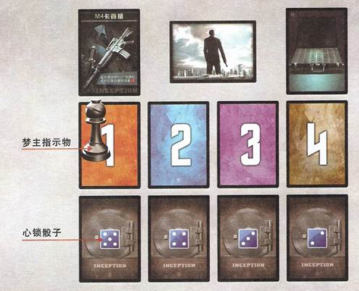

# 正文

游戏支持4–8人进行。梦主1名，盗梦者若干名。  
这是个以寡敌众的多人游戏，演绎梦主与盗梦者们之间的对抗。

## 游戏配件

| 项目 | 数量 |
|------|------|
| 行动牌 | 102张 |
| 盗梦者角色牌 | 18张 |
| 梦主角色牌 | 7张 |
| 梦境牌 | 18张 |
| 金库 | 4张 |
| 策略牌 | 4张 |

| 项目 | 数量 |
|------|------|
| 梦主优势/M4卡宾枪 | 13张 |
| 盗梦卡+减/配置表 | 8张 |
| 梦主指示物 | 1枚 |
| 心锁骰子 | 4枚 |
| 红色骰子 | 2枚 |
| 游戏规则说明书 | 1本 |

## 游戏设置（Game Setting）

### 洗均牌库

游戏开始前，将行动牌混洗成一叠，放在桌子中央作为牌库。

### 确定阵营

游戏开始前，玩家们决定由自认IQ最高的玩家担当梦主，其余玩家皆为盗梦者。

### 盗梦者设置

1. 每人随机派发2张盗梦者角色牌，各选取其中1张，背面朝上盖放于自己面前。  
2. 派发给每位盗梦者两种梦境牌各1张。梦境牌都有两面，一种是1和2，另一种是3和4，分别代表四层梦境。  
3. 盗梦者的梦境牌必须叠放在一起，放在最上面的数字代表该玩家现在身处的梦境层数，所有玩家游戏开始时均处于第1层梦境。

### 梦主设置

1. 随机派发2张梦主角色牌，选取其中1张，背面朝上盖放于自己面前。  
2. 将4张梦境牌按1、2、3、4的顺序排列于自己面前。  
3. 将4张金库按自己的意愿，背面朝上盖放在四层梦境对应的位置，4张金库里面有1张是秘密，不能被盗梦者找到，其他3张是金币。  
4. 按照配置表设置心锁的数量，用心锁骰子表示，将梦主指示物放置于第1层梦境牌上。  
5. 梦主拥有13张特殊牌——梦主优势/M4卡宾枪（详见梦主的四大优势）。  
6. 按照配置表选出本场游戏所需的策略牌，将其混洗并背面朝上放于一旁，游戏过程中，任何玩家包括梦主都不得查看这叠策略牌。

例：6人游戏时，梦主的设置如下图：

#### 配置表

**心锁数量**

| 游戏人数 | 4人 | 5人 | 6人 | 7人 | 8人 |
|---------|----|----|----|----|----|
| Lv1 | 4 | 5 | 5 | 5 | 6 |
| Lv2 | 3 | 4 | 4 | 4 | 5 |
| Lv3 | 2 | 3 | 3 | 3 | 4 |
| Lv4 | 1 | 2 | 2 | 2 | 3 |

**策略牌数**

| 结果 | 4人 | 5人 | 6人 | 7人 | 8人 |
|------|----|----|----|----|----|
| 成功 | 1 | 1 | 1 | 2 | 2 |
| 失败 | 1 | 2 | 2 | 1 | 1 |

## 游戏流程（Game Process）

由梦主开始第一个回合。

### 回合流程

- **0. 回合开始**

- **1. 抽牌阶段**
  - 从牌库顶抽取2张牌作为手牌。

- **2. 出牌阶段**
  - 可以使用任意张手牌。
  - 可以使用特定手牌或技能进行一次成功的解锁（详见解锁）。
  - 可以弃掉任意3张手牌进行复活（详见迷失&复活）。
  - 每使用1张手牌，即执行该牌的效果。
  - 如无特殊说明，每张手牌在使用后均需放入弃牌堆。

- **3. 弃牌阶段**
  - 回合结束时，将手牌弃至剩5张。

- **4. 回合结束**
  - 轮到右手边的玩家开始自己的回合。

### 游戏结束（Game End）

- 在行动牌抽完前，打开了放着秘密的金库，盗梦者阵营获胜。
- 当牌库没牌可以被抽取时，放着秘密的金库没有被打开，梦主阵营获胜。

## 关键说明（Key Explanations）

### 解锁

**盗梦者解锁：**

- 可使用行动牌【解封】，来进行解锁。
- 若解锁成功，同层梦境的心锁数减少1点。
- 若是将心锁骰子由当前面翻转到比之小的面，例如由6翻转到5。
- 每回合只能进行一次成功的解锁。
- 一旦解锁成功后，盗梦者不能再选择以技能或行动的方式进行解锁，也就是说，一般情况下每回合只能成功解锁一次。

### 取消解锁

- 盗梦者解锁时，任意玩家可再使用1张【解封】，即可清除该牌的解锁效果。
- 但【解封】依旧视为已使用。

### 金库

- 当某一层的心锁全部被解开时，该层的金库便被打开，把该金库翻开。
- 若打开的是金币，则梦主可以给予导致金库打开的盗梦者1张贿赂牌（详见贿赂牌）。
- 若打开的是秘密，则游戏结束，盗梦者获胜（详见游戏结束）。

### 贿赂&背叛者

- 当盗梦者打开没有金币的金库，或使用行动牌【梦境窥视】时，梦主即可让该盗梦者随机抽取1张贿赂牌。
- 一个盗梦者可以获得多张贿赂牌。
- 一旦获得的贿赂牌中有其中1张标有“DEAL”字样，就必须成为背叛者。
- 当盗梦者抽到带有“DEAL”的贿赂牌，贿赂成功，该玩家成为背叛者，叛变为梦主阵营，与梦主共同胜负。
- 若盗梦者抽到画面裂开的贿赂牌，则贿赂失败，无任何效果。
- 游戏中，除了被贿赂的盗梦者可以随时查看自己拥有的贿赂牌外，任何玩家包括梦主始终不能查看贿赂牌。

### 掷骰

- 当某位玩家成为 SHOOT 类牌的使用目标时，该玩家掷红色骰子，最后骰子顶面所显示的点数即为掷骰结果。
- 有时掷骰结果会因技能、卡牌效果而增减，但红色骰子始终最大点数为6，最小点数为1。
- 例如当点数是1时，若掷骰结果 -1，其结果仍然为1。

### 死亡

- 当掷骰结果为死亡时，被害者进入迷失层（详见迷失层）。
- 被害者选出2张手牌给予凶手，不足2张则全部给予。
- 死亡的玩家不能发动技能及使用行动牌，同时也不能成为其他人技能及行动牌的目标，且不能复活他人。

### 迷失层

- 玩家会因为死亡等原因进入迷失层。
- 盗梦者进入迷失层时，须将角色牌覆盖于梦境牌之上。
- 梦主进入迷失层时，在被击杀的所在层将梦主指示物放倒。
- 在迷失层里，玩家在其出牌阶段除了复活自己（详见复活）外，不能进行任何行动。

### 复活

- 你的出牌阶段可以弃掉2张手牌复活自己或他人。
- 复活自己时，自己移动到第1层梦境。由于梦主优势的第三个特殊效果，梦主不用复活自己。
- 复活他人时，被复活的玩家移动到自己的所在层。自己在迷失层不能复活他人。

### 移动

- 当盗梦者从某层梦境移动到另一层梦境时，该盗梦者必须将标有对应层的梦境牌展示于自己面前，覆盖另一张梦境牌，以表示该盗梦者目前所在的梦境层次。
- 当梦主从某层梦境移动到另一层梦境时，梦主将梦主指示物移动到对应的梦境牌上。

### 世界观

- 每张梦主角色牌上都附有一个世界观。
- 该世界观作为规则存在于本场游戏中，并可能会改变原有的游戏规则。
- 世界观不会因为梦主的死亡等任何原因而失效。

### 梦主的四大优势

由于梦主于游戏中，在人数对比上已经极其不利，所以必然有特殊效果来增加与盗梦者角逐的本钱。

1. 游戏中梦主开局拥有【M4卡宾枪】，将它置于自己面前。  
   - 【M4卡宾枪】是1个特殊效果道具，它的效果是当梦主使用 SHOOT 类牌时，目标玩家的掷骰结果 -1。

2. 梦主的出牌阶段，可不用功能牌移动到相邻的另一层梦境，每回合仅可使用一次。

3. 梦主的回合开始时，如果梦主处于迷失层，则立即在被击杀的所在层复活，即将梦主指示物在原地竖起。

4. 当盗梦者打开有金币的金库时，梦主可以让该盗梦者抽取1张贿赂牌。

### 黄金定律

当规则或卡牌说明之间冲突时，按如下优先级筛选：
**技能 > 行动牌 > 世界观 > 游戏规则 & 梦主优势 / M4卡宾枪**

---

## 功能牌

### SHOOT（数量：28张）

- **使用时机：** 你的出牌阶段  
- **使用目标：** 除你以外，与您同层梦境的另一位玩家  
- **发动效果：**  
  - 目标玩家掷红色骰子，根据结果对应以下效果：  
    - 2/3/4：该玩家移动到相邻的另一层梦境  
    - 1：该玩家死亡  

**解析：**  

- 令目标玩家移动时，由你来选择移动，目标玩家必须移动。  
- 【SHOOT】除了有一定几率让目标玩家死亡，大多数情况下是通过火力压制，将对方驱逐到另一层梦境。  
- 当然，【SHOOT】也可以对同伴使用，令同伴在危险关头激发技能，以达到帮助同伴移动的目的。

### SHOOT·刺客之王（数量：3张）

- **使用时机：** 你的出牌阶段  
- **使用目标：** 除你以外，任意一层梦境的另一位玩家  
- **发动效果：**  
  - 目标玩家掷红色骰子，根据结果对应以下效果：  
    - 3/4/5：该玩家移动到相邻的另一层梦境  
    - 1/2：该玩家死亡  

**解析：**  

- 在你与其他玩家处于不同梦境的时候，它能发挥最大功效。  
- 特别是当目标玩家就在你的相邻梦境，而你手上还有其他特殊 SHOOT 时，即使掷骰结果不是2或1，你仍有一半机会把目标拉近身边，然后再施加火力压制。

### SHOOT·爆甲螺旋（数量：3张）

- **使用时机：** 你的出牌阶段  
- **使用目标：** 除你以外，与您同层梦境的另一位玩家  
- **发动效果：**  
  - 目标玩家掷红色骰子，根据结果对应以下效果：  
    - 3/4/5：令该玩家展示手牌，弃掉所有【解封】，并移动到相邻的另一层梦境  
    - 1/2：该玩家死亡  

**解析：**  

- 【解封】是《盗梦都市》里最为关键的卡牌，而【SHOOT·爆甲螺旋】正是【解封】的克星。  
- 面对它，你只有两个选择：要么自愿死亡，要么把手上的【解封】全部丢弃后离开。  

### SHOOT·炸裂弹头（数量：3张）

- **使用时机：** 你的出牌阶段  
- **使用目标：** 除你以外，与您同层梦境的另一位玩家  
- **发动效果：**  
  - 目标玩家掷红色骰子，根据结果对应以下效果：  
    - 3/4/5：令该玩家展示手牌，弃掉所有 SHOOT 类牌，并移动到相邻的另一层梦境  
    - 1/2：该玩家死亡  

**解析：**  

- 相比【SHOOT·爆甲螺旋】显得效果较差，但往往能让目标玩家瞬间失去战斗力。  
- 也有一半的几率将目标玩家所有普通和特殊的 SHOOT，以此在短时间内获得优势，令这趟梦境旅程更加安全。

### 解封（数量：24张）

- **使用时机：**
  - 你的出牌阶段  
  - 任意玩家使用【解封】效果时  
- **使用目标：**
  - 你的同层的心锁  
  - 另一张用于解锁的【解封】  
- **发动效果：** 选择以下一个效果  
  1. 对当层梦境进行一次解锁，复活后不能在当回合使用此效果。  
  2. 抵消1张【解封】的解锁效果。  

**解析：**

- 梦主不能使用【解封】效果。  
- 任何玩家在有人使用【解封】效果时，都可以使用【解封】效果。  
- 【解封】效果一旦不能被抵消，例如当有玩家用【解封】的【解封】效果抵消其他玩家的【解封】时，不能再使用另一张【解封】来抵消第二张【解封】的效果。

### 梦境穿梭剂（数量：20张）

- **使用时机：** 你的出牌阶段  
- **使用目标：** 你  
- **发动效果：** 你移动到相邻的另一层梦境。  

**解析：**

- 第1层梦境与第4层梦境是不同的，所以当你处于第1层梦境时，你无法移动到第4层梦境，反之亦然。

### 梦境窥视（数量：8张）

- **使用时机：** 你的出牌阶段  
- **使用目标：** 任意一层梦境的金库 / 一名已被赎赂的盗梦者  
- **发动效果：** 选择以下一个效果  
  1. 仅盗梦者使用：梦主可以先给予你1张贿赂牌。你查看任意一层梦境的金库，且不得公布结果。  
  2. 仅梦主使用：查看一名盗梦者的所有贿赂牌。  

**解析：**

- 当盗梦者使用【梦境窥视】效果时，梦主先决定是否让该盗梦者抽取1张贿赂牌，然后该盗梦者再查看任意一层梦境的金库。  
- 当梦主的赎赂牌已经完时，使用【梦境窥视】是不会收到贿赂牌的，也即是说盗梦者阵营接下来窥视金库都是无负担的。

### 念力牵引（数量：5张）

- **使用时机：** 你的出牌阶段  
- **使用目标：** 除你以外，任意一名玩家  
- **发动效果：** 将另一位玩家移动到你的所在层。  

**解析：**

- 无论你是梦主阵营，当你知道放置秘密的金库所在时，能够将敌人带到危险的同伴处，或者将敌人拉近身边，施加火力压制。  
- 由于死亡的玩家不会受到卡牌效果的影响，所以不能被【念力牵引】所移动。

### 凭空造物（数量：3张）

- **使用时机：** 你的出牌阶段  
- **使用目标：** 你  
- **发动效果：** 你从牌库顶抽2张牌。  

**解析：**

- 在你集到5张手牌的同时，也在消耗牌库，加快游戏结束的到来。

### 移形换影（数量：5张）

- **使用时机：** 你的任意阶段  
- **使用目标：** 除你以外，任意一名玩家  
- **发动效果：** 与另一位盗梦者交换角色牌，直到回合结束。  

**解析：**

- 该牌为 F 类，不建议在初次游戏中加入该牌。  
- 梦主可以对盗梦者使用该牌，但盗梦者不能对梦主使用【移形换影】。  
- 一回合内可以使用【移形换影】多次，但当回合结束时，必须把场上的角色牌还原到本回合开始前的位置。  
- 若场上有些角色的技能是在抽牌阶段有效，而你想使用该技能，可以在你抽牌阶段使用该技能。

## 盗梦者

### JOKER 小丑

**技能：**  
失控：如果你除过抽牌阶段，可以掷1颗骰子，抽牌数改为掷骰结果，则你在弃牌阶段必须弃掉所有手牌。

**详述：**  

- 掷出骰子的点数为几，就可抽几张牌，但回合结束时，必须弃掉所有手牌。  
- 所以【失控】最好是在手牌少或弃牌的情况下使用。  
- 有另一种方式则是当手中有【移形换影】时使用【失控】，然后在弃牌阶段前使用【移形换影】换成其他角色，因为【移形换影】直到回合结束才失效，所以在弃牌阶段不用弃掉手牌。

### POINT MAN 先锋

**技能：**  
嗅探：你可以展示抽牌阶段所抽取的牌，若其中含有【梦境穿梭剂】，则再从牌库顶抽2张牌。

**详述：**  

- 假如展示的牌中出现【梦境穿梭剂】，再抽取的2张牌是直接加入手牌的，所以不能被展示。

### TOURIST 穿行者

**技能：**  
支援：你的出牌阶段，可以将所有手牌（至少1张）给予另一位玩家，然后你移动到该玩家的所在层。

**详述：**  

- 假设你现在处于第二层梦境，手牌中没有【梦境穿梭剂】，你想移动到第四层梦境，可以将所有手牌给予一位处于第四层梦境的玩家，然后移动到第四层梦境。  
- 使用该技能后，你必须有1张手牌，否则无法发动此技能。

### SHADE 影子

**技能：**  
随行：你的出牌阶段，可以随时移动到梦主的所在层。

**详述：**  

- 如果影子没有被赎赂，她是一个令梦主感到困扰的盗梦者。  
- 在她的回合出牌阶段，随时随地都能使用【随行】的效果，通过一般的方式控制她的行动非常困难，这对梦主来说是尤为不利。

### AVATAR 降世神通

**技能：**  
降临：你的出牌阶段，当你移动到数字更大的梦境时，可以从牌库顶抽2张牌。

**详述：**  

- 【降临】只能在数字由小到大的梦境移动中才能使用。  
- 例如从第一层到第二层可以使用，而第二层到第一层不能。  
- 当降世神通在回合中，从迷失层移动到一层梦境，视为从0移动到1层，故此时可以触发【降临】的效果。  
- 降世神通爆发的机会来自于【梦境穿梭剂】，每次移动的同时都会抽2张牌，并且削减牌库，无论作为盗梦者阵营或是梦主阵营，他的存在都不容小觑。

### ARCHITECT 筑梦师

**技能：**  
迷宫：你的出牌阶段，可以弃掉1张 SHOOT 类牌，令同层梦境的一位玩家在他/她的下一个回合结束前，不受到行动牌和技能的影响，且不能移动。

**详述：**  

- 成为【迷宫】目标的玩家，仍然可以复活、进行解锁、抵消解锁效果，或使用行动牌。  
- 对自己使用【迷宫】效果，对方在内的任何行动牌都不会生效。  
- 对自己使用的技能效果，若属于【锁】技能无法让自己抽牌，但可将启动技能手牌给予他人。  
- 【迷宫】并不能解除世界观的影响。

### CHEMIST 药剂师

**技能：**  

- **调剂：**你的出牌阶段，你可以弃掉1张手牌，然后将弃牌堆1张【梦境穿梭剂】收为手牌。每回合仅可使用两次。  
- **注射：**你的出牌阶段，可以对同层梦境的玩家使用【梦境穿梭剂】。

**详述：**  

- 【调剂】可以简单理解为把1张手牌当成1张【梦境穿梭剂】。  
- 当然，必须先确定弃牌堆中是否存在【梦境穿梭剂】。  
- 任何玩家可以随时检视弃牌堆中的牌。

### FORGER 欺诈师

**技能：**  
诡计：你的出牌阶段，可以抽取另一位玩家的最多2张手牌，然后把抽取量相等的手牌还给该玩家。每回合仅可使用一次。

**详述：**  

- 【诡计】的效果可以只与另一位玩家交换1张手牌。  
- 可以将抽取另一位玩家的手牌还回该玩家，因为抽取的手牌也是欺诈师的手牌。  
- 【诡计】具有窃取秘密的能力，通过交换手牌来知悉其他玩家的身份与想法，并且做到意想不到的配合，或者限制对手。

### SOUL SCULPTOR 灵雕师

**技能：**  
雕琢：当你使用 SHOOT 类牌时，掷骰后，可以用目标玩家的手牌数量来作为最终掷骰结果，不能被其它效果所改变。

**详述：**  

- 【雕琢】的效果使用后，掷骰结果无法再被改变。  
- 例如灵雕师对梦主【要塞】使用 SHOOT 类牌时，灵雕师使用【雕琢】技能，将掷骰结果视为梦主的手牌数。  

### SPACE QUEEN 空间女王

**技能：**  

- **支援：**当另一位玩家成功解锁时，你可以从牌库顶抽1张牌。  
- **造物：**任意玩家的弃牌阶段，你可以把1张手牌放置到牌库顶。

**详述：**  

- 【造物】可以在关键时候，控制玩家抽上来的手牌。  
- 例如空间女王的同伴需要一张【梦境穿梭剂】，可以在同伴的上一位玩家弃牌阶段时，将该【梦境穿梭剂】放置到牌库顶。  
- 当然，也可以用同样的方式回收对手。

### LORD OF WAR 战争之王

**技能：**  
黑市：你的出牌阶段，你可以弃掉2张手牌，然后将弃牌堆里的1张牌收为手牌。每回合仅可使用一次。

**详述：**  

- 战争之王能够拥有任何想要的牌，但是必须时刻确保弃牌堆里的牌有什么。

### BLACK SWAN 黑天鹅

**技能：**  
纷飞：你可以跳过抽牌阶段，并将所有手牌（最少1张）给予任意数量的其他盗梦者，然后从牌库顶抽取4张牌。

**详述：**  

- 黑天鹅可以每回合结束前都尽可能用剩1张手牌，在下回合抽牌阶段将这些牌分到同伴，从而抽取更多手牌，并且得益。  
- 【纷飞】的效果可以对多位玩家同时生效，例如将所有5张手牌分给5位玩家。  

### DREAM INTERPRETER 译梦师

**技能：**  
伏笔：当你使用【解封】时，可以从牌库顶抽2张牌。

**详述：**  

- 当使用【解封】来抵消其他【解封】的解锁效果时，也视为使用【伏笔】成功。

### EXTRACTOR 尊隐猎手

**技能：**  
萃取：当你成功解锁后，可以从牌库顶抽取与当层梦境现有心锁相等数量的牌。

**详述：**  

- 【萃取】的效果会随着游戏时间的推移而愈来愈弱。  
- 当层梦境有心锁指的是解锁后的心锁数。  
- 例如解锁前心锁数是6，成功解锁后则是5，所以此时使用技能【萃取】可以从牌库顶抽5张牌。

### JUDGER OF MIND 意念判官

**技能：**  
定罪：当你使用 SHOOT 类牌时，目标玩家改为掷2颗骰子，由你选择其中1颗作为掷骰结果。

**详述：**  

- 对同伴使用【定罪】时，本身普通【SHOOT】的移动概率就为二分之一，现在将有更高的几率帮助同伴穿梭梦境。  
- 在对敌方使用【定罪】时，又能增加概率将对手定罪或者击杀。  
- 但也难免出现掷出结果一样的情况，例如两个6，意念判官将最为无奈。  

### MARTYR 殉道者

**技能：**  
牺牲：你可以略过出牌阶段，掷1颗骰子，若结果为3/4/5/6，则增加或减少当层梦境2个心锁。此技能结束后立即死亡，并弃掉所有手牌。心锁数不能超过原有数量。

**详述：**  

- 效果如其名，通过牺牲来直接对游戏胜负的根本——心锁进行影响的技能。  
- 行动牌【解封】只能取消【解封】的解锁效果，所以对【牺牲】没有影响。

---

### PAPRIKA 灵魂牧师

**技能：**  
拯救：你的出牌阶段，可以弃掉1张手牌，使一位在迷失层的玩家复活至你的所在层，并把该玩家的所有手牌收为自己的手牌。每回合仅可使用两次。

**详述：**  

- 【拯救】是可以对迷失层玩家进行影响的技能。  
- 名副其实的梦境医师，由于玩家在复活后当回合不能使用【解封】，【拯救】这种代价极低的复活方式，绝对是梦主最大的威胁。  
- 梦主只能回合都保证能击杀灵魂牧师，或者不对盗梦者们使用 SHOOT 类牌，以保证【拯救】没有发动机会。  
- 因为黄金定律说明了技能大于世界观，所以【拯救】是不会被梦主【密道】的世界观所影响的。

### TERRORIST 恐怖分子

**技能：**  

- **追杀：**你使用的 SHOOT 类牌不受层数限制。  
- **狂热：**当你使用 SHOOT 类牌时，除非目标玩家在掷骰前弃掉1张手牌，否则掷骰结果 -1。

**详述：**  

- 假设恐怖分子处于第一层梦境，而目标玩家正在第四层梦境，恐怖分子依然可以对目标玩家使用 SHOOT 类牌。  
- 恐怖分子对目标玩家使用【狂热】时，目标玩家必须在掷骰前弃掉1张手牌，否则掷骰结果 -1。  
- 【狂热】会被其它效果所影响。

## 梦主

### 黑洞

**技能：**  
倒流：你的每回合抽牌阶段，在金库没被打开的每层梦境各恢复2个心锁。心锁数不能超过原有数量。

**世界观：**  
盗梦者每回合可以成功解锁两次。

**详述：**  

- 例如第二层梦境的金库开始时心锁数为5，假如一轮内被盗梦者解锁至3。  
- 当轮到梦主回合，若该层金库未被打开，则梦主回合抽牌阶段恢复2个心锁，心锁变为5。  
- 每一层梦境，只要是未被打开的金库，在梦主回合抽牌阶段都会增加2个心锁。  
- 心锁数的原有数量，指的是游戏开始时心锁的配置数量。  
- 例如第二层梦境开始时心锁数为5，假如一轮内被盗梦者解锁至4，当轮到梦主回合，心锁数也会变为5。

### 港口

**技能：**  
海啸：当任一金库被打开，游戏没有结束时，所有盗梦者各掷一次骰子。若结果为1/2/3/4/5，则该盗梦者移动到迷失层。

**世界观：**  
当两个金库被打开时，仍未打开秘密，则游戏结束，梦主阵营获胜。

**详述：**  

- 当盗梦者打开了金库，而里面的是金币时，就会触发技能【海啸】的效果，所有盗梦者必须掷骰子。  
- 掷骰结果为指定点数的盗梦者，须移动到迷失层。  
- 该效果不是由梦主对目标使用，所以直接跳过了击杀状态，没有凶手与被害者，不用给予手牌。  
- 同样，由于不是被梦主击杀，所以不能叠加【M4卡宾枪】的效果。

### 皇城

**技能：**  
重金：当你给予盗梦者赎赂牌时，你可以选取1张给该盗梦者。

**世界观：**  
当玩家收到赎赂牌时，该玩家选择另一位未收到赎赂牌的盗梦者视为使用1张【SHOOT】，掷骰结果 -3。

**详述：**  

- 无论盗梦者打开有金币的金库，或是使用了【梦境窥视】，只要是梦主选择给予盗梦者赎赂牌，都是由梦主查看所有未派出的赎赂牌，再选出其中1张交给该盗梦者。  
- 游戏中，此梦主可以随时查看所有未派出的赎赂牌，不能查看已经给盗梦者的赎赂牌。  
- 该梦主的世界观指的【SHOOT】是普通 SHOOT。  
- 该梦主的世界观会被其它效果所影响。  

### 盛宴

**技能：**  
充盈：你的抽牌阶段，你每拥有1张未派发的贿赂牌则多抽1张。

**世界观：**  
所有盗梦者抽牌阶段的抽牌数量 +1。

**详述：**  

- 如开场梦主拥有3张贿赂牌，则抽牌阶段抽5张牌。  
- 若派发出1张给盗梦者，则减少一张，即在抽牌阶段抽4张牌。  
- 所有盗梦者，在不使用技能的情况下，由于世界观的影响，他们在抽牌阶段都能抽3张牌。

---

### 密道

**技能：**  
传送：你的【梦境穿梭剂】可以将任一盗梦者移动至迷失层。每回合仅可使用两次。

**世界观：**  
只能通过弃掉1张【梦境穿梭剂】才能复活，梦主优势不受影响。

**详述：**  

- 无论目标盗梦者在哪一层梦境，梦主只需1张【梦境穿梭剂】便能将其移动至迷失层。  
- 被【梦境穿梭剂】送往迷失层的盗梦者，不需要给予手牌，因为他们直接跳过了击杀状态。  
- 这个梦主的世界观改变了原有的复活规则，不能通过弃掉2张手牌进行复活，而是变为必须弃掉1张【梦境穿梭剂】来复活自己或他人。  
- 该梦主的世界观会被其它效果所影响。

---

### 要塞

**技能：**  
冷酷：你的出牌阶段，当你移动到另一层梦境时，可以视为对任一盗梦者使用1张【SHOOT】。

**世界观：**  
梦主的掷骰结果 -1。

**详述：**  

- 在梦主的回合，若梦主从第一层移动到第二层梦境时，就相当于梦主可以“免费”使用1张普通【SHOOT】。  
- 梦主不用打出任何卡牌，然后随便指定存在于任一层梦境的另一位玩家，该玩家则掷骰子进行闪避判定。  
- 该梦主的世界观会被其它效果所影响。

---

### 棋局

**技能：**  
易位：当金库要被打开时，你可以把该金库与任意一层未翻开的金库交换。此技能仅可使用两次。

**世界观：**  
使用【梦境窥视】时，从牌库顶抽2张牌。

**详述：**  

- 例如第一层梦境的金库即将被打开时，第二层梦境的金库还未被打开，梦主便可以不打开第一层梦境的金库，并将第二层梦境的金库与第一层的交换，然后打开的是原本第二层梦境的金库。  
- 在这个世界观里，每当使用【梦境窥视】，都必须从牌库顶抽2张牌。  
